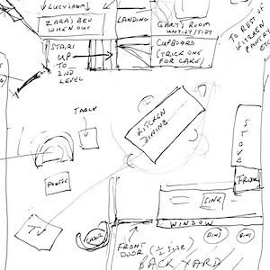
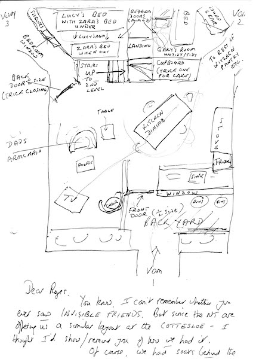
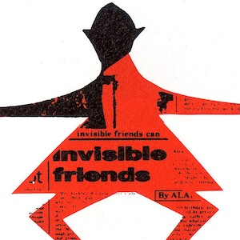
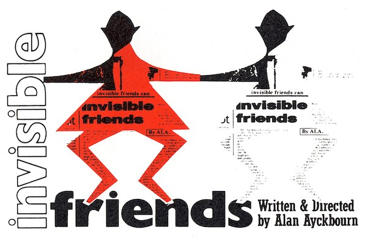

A collection of archive material, posters, rehearsal and production images pertaining to Alan Ayckbourn's *Invisible Friends*. The Archive Images page is presented in association with the **[Borthwick Institute for Archives](/)** at the University of York where the Ayckbourn Archive is held. Click on an image to expand.

### Invisible Friends (1989)

Alan Ayckbourn's sketch of the set layout for the world premiere of *Invisible Friends* at the Stephen Joseph Theatre in the Round, Scarborough, in 1989. This is unusual for an Ayckbourn production as it required the theatre-in-the-round to become three-sided to accommodate Lucy's bedroom and all it's illusions.

*Do not reproduce images without permission of the copyright holder.*

The rarely seen poster image for the world premiere of *Invisible Friends* at the Stephen Joseph Theatre in the Round, Scarborough, in 1989. At the time, individual production programmes were not published and posters rarely kept for archive. As a result this image has rarely been seen since 1989.

**Copyright:** Scarborough Theatre Trust  
**Holding:** Ayckbourn Digital Archive

*Do not reproduce images without permission of the copyright holder.*      *The Archive Images pages are presented in association with the* ***[Borthwick Institute for Archives](/)*** *at the University of York, where the Ayckbourn Archive is held.*

*All images on this page are copyright of the respective and labelled individual / organisation and should not be reproduced without permission.*  
