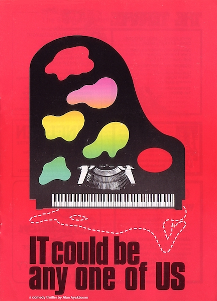
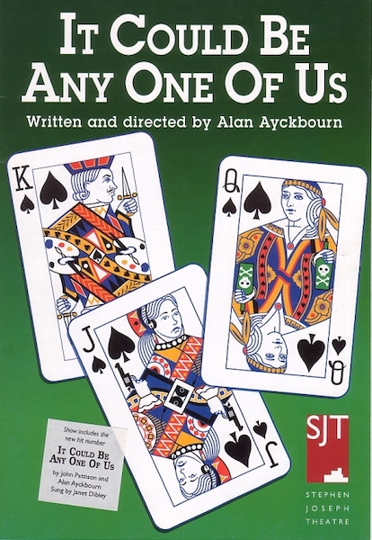

A collection of archive material, posters, rehearsal and production images pertaining to Alan Ayckbourn's *It Could Be Any One Of Us*. The Archive Images page is presented in association with the **[Borthwick Institute for Archives](/)** at the University of York where the Ayckbourn Archive is held. Click on an image to expand.

### It Could Be Any One Of Us (1983)

The poster for the world premiere of *It Could Be Any One Of Us* at the Stephen Joseph Theatre in the Round, Scarborough, in 1983. The poster cleverly references the three artists (musician, writer and painter) and the victim.

**Copyright:** Scarborough Theatre Trust  
**Holding:** Borthwick Institute for Archives

*Do not reproduce images without permission of the copyright holder.*

The poster for Alan Ayckbourn's 1996 revival of *It Could Any One Of Us* at the Stephen Joseph Theatre, Scarborough. The poster references the random element of the play in which the killer is decided during a game of cards at the start of the play.

**Copyright:** Scarborough Theatre Trust  
**Holding:** Borthwick Institute for Archives

*Do not reproduce images without permission of the copyright holder.*  
*The Archive Images pages are presented in association with the* ***[Borthwick Institute for Archives](/)*** *at the University of York, where the Ayckbourn Archive is held.*

*All images on this page are copyright of the respective and labelled individual / organisation and should not be reproduced without permission.*  
