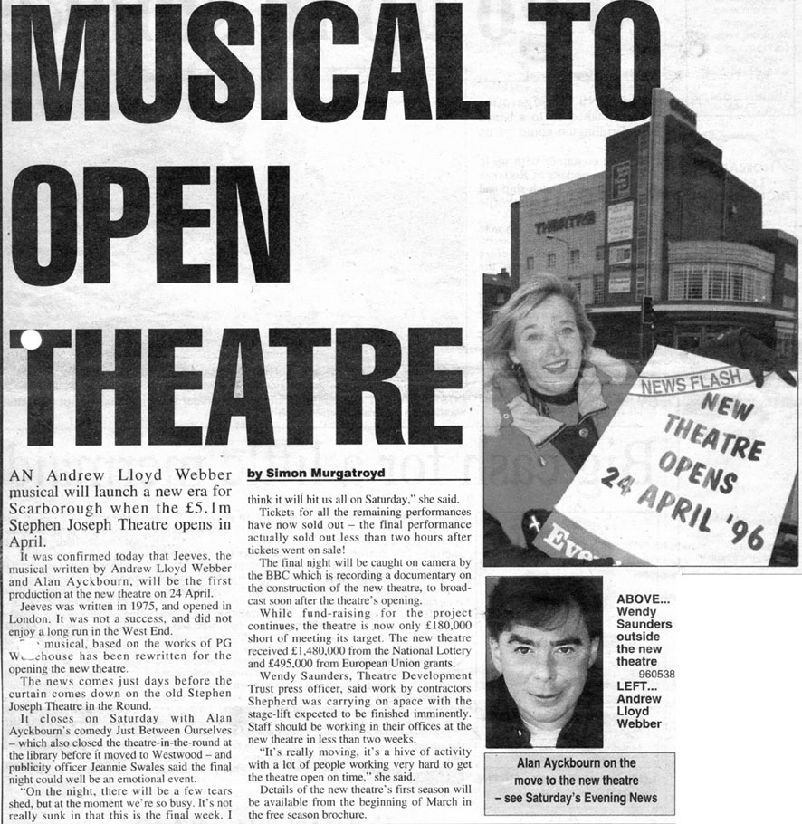

*This story was the front page lead on the Scarborough Evening News on 31 January 1996. It was the first story to confirm both the date of the opening of the Stephen Joseph Theatre and that a revised version of the musical Jeeves would open the venue.*  
*The announcement was not official - and apparently final contracts had not yet been signed - however when another regional Yorkshire paper looked set to break a tacit embargo on the news, the paper local to the Stephen Joseph Theatre published the story.*

*Copyright: Yorkshire Regional Newspapers. Please do not reproduce without the permission of the copyright holder.*
