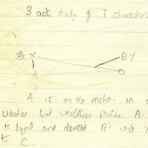
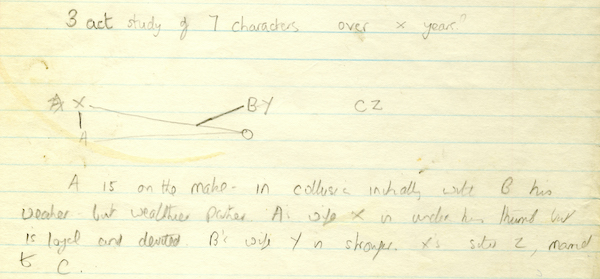
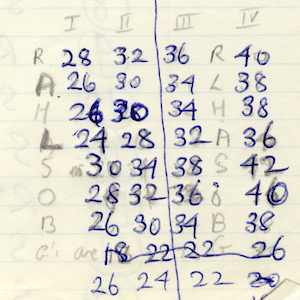
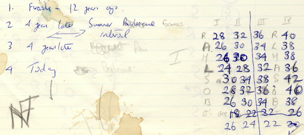
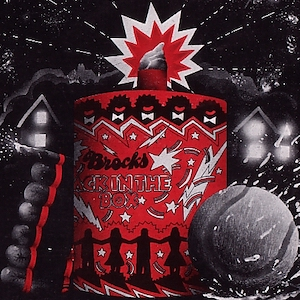
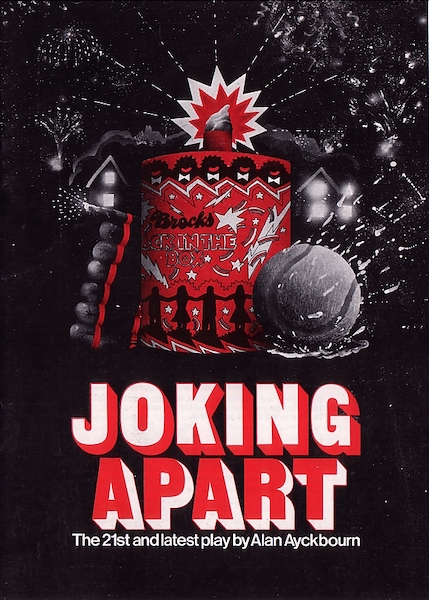
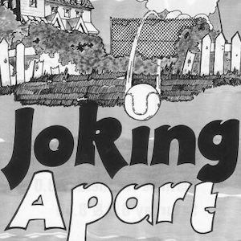
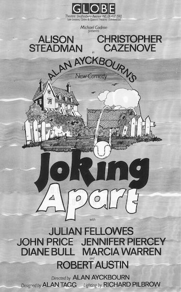

A collection of archive material, posters, rehearsal and production images pertaining to Alan Ayckbourn's *Joking Apart*. The Archive Images page is presented in association with the **[Borthwick Institute for Archives](/)** at the University of York where the Ayckbourn Archive is held. Click on an image to expand.

### Joking Apart (1978)

Alan Ayckbourn's earliest notes for *Joking Apart* suggest a 'three act study of seven characters over x years' alongside a diagram of unspecified relationships. The actual play is four scenes with 11 characters over 12 years.

*Do not reproduce images without permission of the copyright holder.*

More early notes by Alan Ayckbourn for *Joking Apart* showing the 4 scene structure of the play over 12 years - emphasising the play begins in the past and moves to the present - alongside the ages for each of the characters in each scene.

*Do not reproduce images without permission of the copyright holder.*

The poster for the world premiere of *Joking Apart* at the Stephen Joseph Theatre in the Round in 1978.

**Copyright:** Scarborough Theatre Trust  
**Holding:** Borthwick Institute for Archives

*Do not reproduce images without permission of the copyright holder.*

A flyer for the West End premiere of *Joking Apart* at the Globe Theatre in 1979.

**Copyright:** To be confirmed  
**Holding:** Borthwick Institute for Archives

*Do not reproduce images without permission of the copyright holder.*    *The Archive Images pages are presented in association with the* ***[Borthwick Institute for Archives](/)*** *at the University of York, where the Ayckbourn Archive is held.*

*All images on this page are copyright of the respective and labelled individual / organisation and should not be reproduced without permission.*  
