A collection of archive material, posters, rehearsal and production images pertaining to Alan Ayckbourn's *Just Between Ourselves*. The Archive Images page is presented in association with the **[Borthwick Institute for Archives](/)** at the University of York where the Ayckbourn Archive is held. Click on an image to expand.

### Just Between Ourselves (1976)

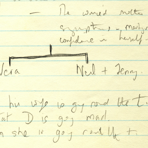

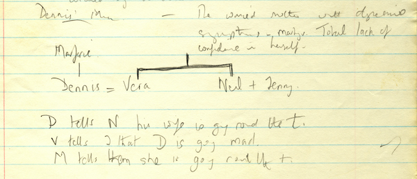

Alan Ayckbourn's early notes for *Just Between Ourselves* reveal considerable differences with the final play. Here the notes indicate that it is not just Vera heading for a breakdown, but that Dennis is also struggling with mental issues too.

*Do not reproduce images without permission of the copyright holder.*

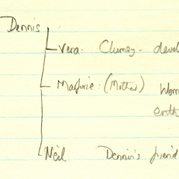

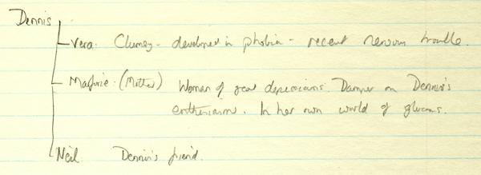

More of Alan Ayckbourn's early notes for *Just Between Ourselves* at which point, Dennis' mother - Marjorie - is also depressive and Dennis struggles with this; almost the antithesis of the character in the actual play.

*Do not reproduce images without permission of the copyright holder.*

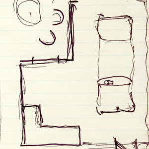

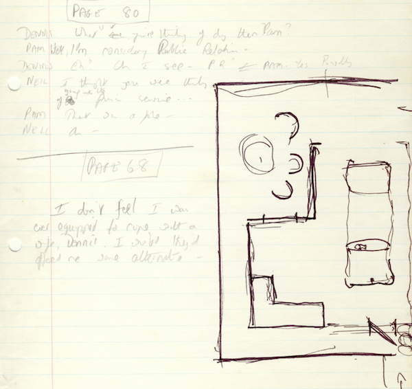

The first sketch by Alan Ayckbourn of the set for *Just Between Ourselves* showing the garage and patio which features in the final play.

*Do not reproduce images without permission of the copyright holder.*

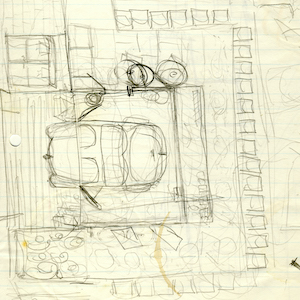

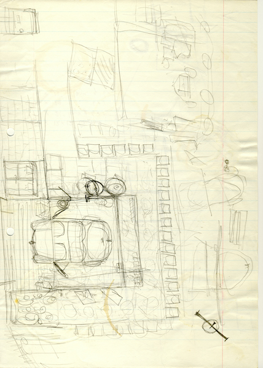

A more detailed sketch of the *Just Between Ourselves* set by Alan Ayckbourn for the world premiere production at Theatre in the Round at the Library Theatre, Scarborough, in 1976.

*Do not reproduce images without permission of the copyright holder.*

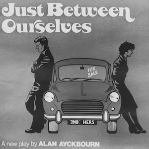

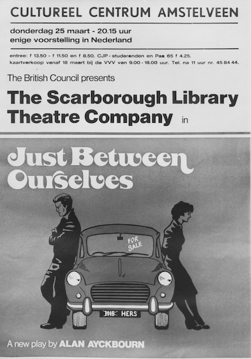

*Just Between Ourselves* was the first Alan Ayckbourn production to tour overseas from Theatre in the Round at the Library Theatre, Scarborough. This is a poster for its European left leg of the tour.

**Copyright:** Scarborough Theatre Trust  
**Holding:** The Bob Watson Archive

*Do not reproduce images without permission of the copyright holder.*

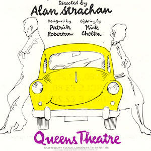

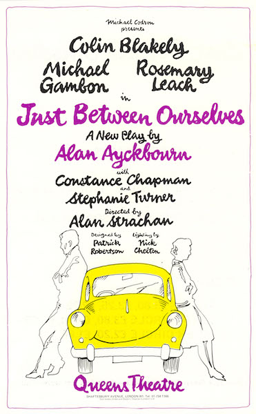

A flyer for the 1977 West End premiere of *Just Between Ourselves* at the Queen's Theatre.

**Copyright:** Michael Codron Productions  
**Holding:** Borthwick Institute For Archives

*Do not reproduce images without permission of the copyright holder.*

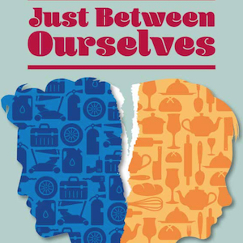

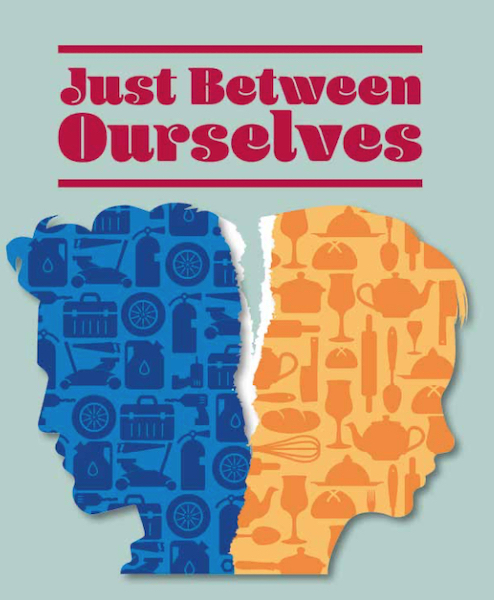

Alan Ayckbourn was due to revive *Just Between Ourselves* at the Stephen Joseph Theatre, Scarborough, during 2020. Unfortunately, the production was cancelled due to the Covid-19 global pandemic but not before advertising had begun for the production including this poster.

**Copyright:** Scarborough Theatre Trust  
**Holding:** Ayckbourn Digital Archive

*Do not reproduce images without permission of the copyright holder.*     *The Scene and Archive Images pages are presented in association with the* ***[Borthwick Institute for Archives](/)*** *at the University of York, where the Ayckbourn Archive is held.*

*All images on this page are copyright of the respective and labelled individual / organisation and should not be reproduced without permission.*  
