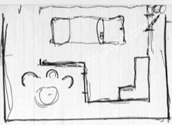
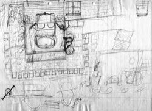
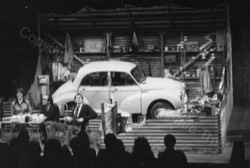
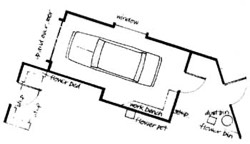

*Just Between Ourselves* premiered at Theatre in the Round at the Library Theatre, Scarborough, in 1976 and is one of a select few Alan Ayckbourn plays which was not first performed in the round, where the majority of his plays are premiered.

The play was originally presented in a thrust production due to the limitations of the space at that particular time at Theatre in the Round at the Library Theatre; however it is not considered one of the five Ayckbourn plays which were specifically written for end-stage performance.

Traditionally the company was based in Scarborough's public library's large concert room, however for the 1974/75 and 1975/76 winter seasons, the company was forced to use a smaller adjacent room which imposed severe restrictions on the staging.

Whereas early *Bedroom Farce* sketches indicate Alan intended to stage the play in the round, only to have changed to thrust-staging to accommodate the set, it appears from early sketches for *Just Between Ourselves* that the playwright considered the possibility of a problem with the space from the start and designed a set that would work in a thrust or end-stage configuration, but that for future productions could also be staged in the round without altering the layout of the set.

Alan Ayckbourn's earliest design of the set (fig.1 below) was re-discovered in 2009 and is sketched on A4 foolscap alongside the first hand-written draft of the play. It contains all the elements of the final set, except the garden on the right of the garage and the car is parked horizontally rather than vertically. There is no indication of whether this is a sketch for the round or for its actual thrust staging. What is interesting is it is a rare example - from this period of his writing - of an early conception of the stage being virtually identical to what was actually produced.

There are just two early design sketches by Alan Ayckbourn and the second (fig.2) is a very simple sketch found in the corner of a hand-written page of amendments to a *Just Between Ourselves* script. Although basic, it has all the elements of the final play as they would be produced as demonstrated by the photograph of the world premiere production (fig.3).

The final sketch (fig.4) is taken from the Samuel French acting edition of the play and reproduces the play as it would appear end-stage; presumably based on the 1977 London production which was designed by Patrick Robertson. What is clear is there is actually very little difference in the layout of the stage from how it was conceived and initially produced in the world premiere production.

Although no design survives of the 1996 revival of the play, it was staged in the round - demonstrating the play was as suitable to the round as end-stage and thrust. The layout of the set was practically identical but with walls cut off at waits level on all sides of the garage but the garage door. The garage was also not L-shaped but rectangular taking up approximately half of the stage with the other half given over to an extended patio and garden area.

The major challenge with the set of *Just Between Ourselves* has always been having a full size car on stage (originally a Morris Minor in the world premiere production) and for the original production, a car was sawn into four quarters in order to get it onto the first floor of the library. When the play was revived at the Stephen Joseph Theatre In The Round, Scarborough, in 1996, there was an equal problem in getting the car to fit through the voms \[stage entrances\] as this was the only entrance to the round and were of a fixed width; the car eventually had to be put on its side and slid through the voms).

*(1) Alan Ayckbourn's first set sketch from 1976.  
Copyright: Alan Ayckbourn*

*(2) Alan Ayckbourn's refined sketch from 1976.  
Copyright: Alan Ayckbourn*

*(3) The set of the world premiere in 1976.  
Copyright: Scarborough Theatre Trust*

