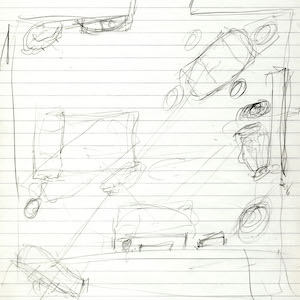
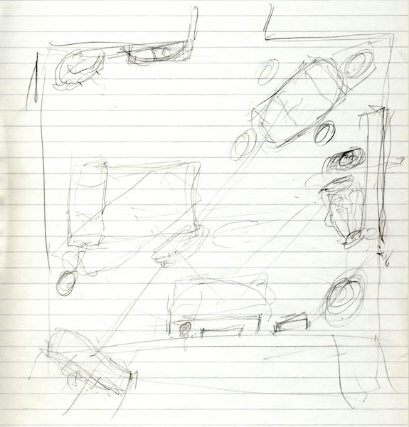
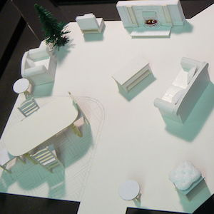
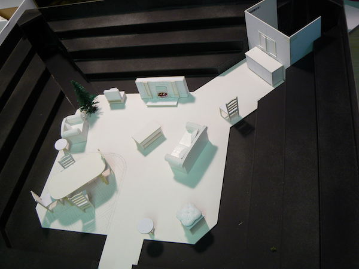
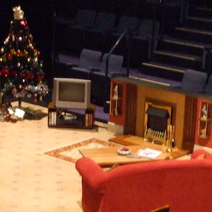
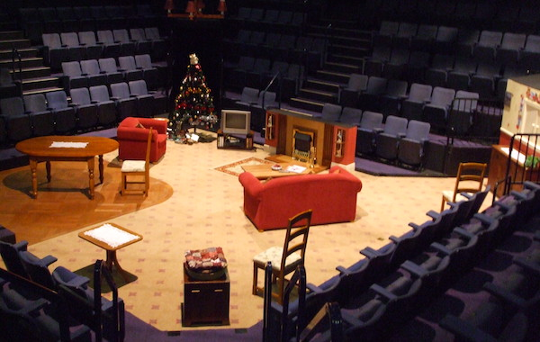

A collection of archive material, posters, rehearsal and production images pertaining to Alan Ayckbourn's *Life & Beth*. The Archive Images page is presented in association with the **[Borthwick Institute for Archives](/)** at the University of York where the Ayckbourn Archive is held. Click on an image to expand.

### LIfe & Beth (2008)

Alan Ayckbourn's original hand-drawn sketch for the in-the-round set for the world premiere of *Life & Beth* in 2008.

*Do not reproduce images without permission of the copyright holder.*

Designer Pip Leckenby's white card model box for the in-the-round set of the world premiere of *Life & Beth* in 2008.

**Copyright:** Pip Leckenby  
**Holding:** Ayckbourn Digital Archive

*Do not reproduce images without permission of the copyright holder.*

The actual set, designed by Pip Leckenby, for the world premiere of *Life & Beth* at the Stephen Joseph Theatre, Scarborough, in 2008.

**Photographer:** Simon Murgatroyd (© Simon Murgatroyd)  
**Holding:** Ayckbourn Digital Archive

*Do not reproduce images without permission of the copyright holder.*     *The Archive Images pages are presented in association with the* ***[Borthwick Institute for Archives](/)*** *at the University of York, where the Ayckbourn Archive is held.*

*All images on this page are copyright of the respective and labelled individual / organisation and should not be reproduced without permission.*  
