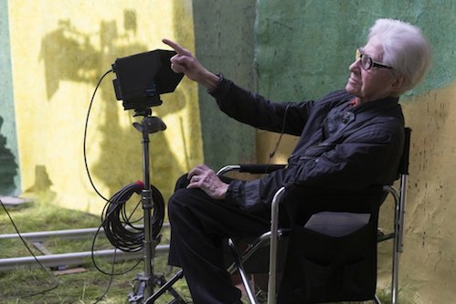
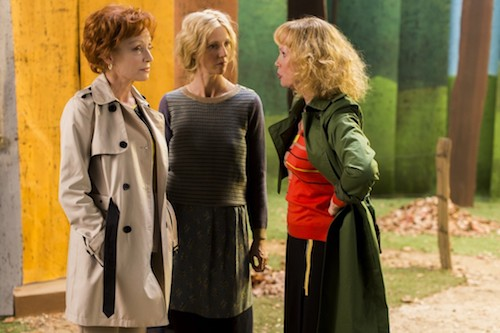
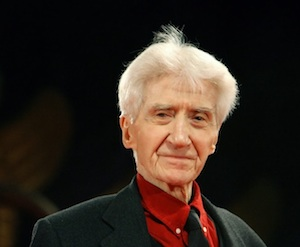

### Alain Resnais Discusses Life Of Riley & Alan Ayckbourn

*Life Of Riley was Alain Resnais's final film and his third adaptation of an Alan Ayckbourn play. For the film's UK release, distributer Eureka! Entertainment provided this final analysis of the film and the auteur's relationship with the playwright written by Alain Resnais before his death.*

<aside>

*Alain Resnais directing Aimer, Boire et Chanter.*  
*(Copyright: Eureka productions)*

</aside>

Why is the original title *Aimer, Boire et Chanter*, which has nothing to do with the original title of Alan Ayckbourn’s play, *Life of Riley*? It’s a question of rhythm. Pink Floyd’s music permeated all through the play. That to me indicated a specific era, the 1960s and 1970s, and I wanted to move away from it. I try hard to give rhythm to the changes of pace in a film, so that the directing is full of contrast: moments when the direction is reserved and academic, and then suddenly there’s a change in tone. Here’s what I dream of: that the viewer in the movie theatre says to himself, “yeah, okay, it’s filmed theatre,” and then suddenly changes his mind: “yes, but in theatre you can’t do that...” And it goes back and forth from theatre to film, and sometimes over to comic strips with Blutch’s input. I’d like to try to achieve what Raymond Queneau called in *Saint-Glinglin* “la brouchecoutaille,” a sort of ratatouille, by breaking down the walls between film and theatre and thus ending up totally free. I say it for all my films: what interests me is form, and if there’s no form, there’s no emotion. I still get a kick out of bringing together things that shouldn’t meet. It’s that I call the attraction of danger, of the abyss.

Keeping constantly in mind the standard answer I give the question, “Why do you make movies?” - “To see how they’re made.” So I naturally fell for Ayckbourn’s theater, which might seem like light comedy, but that’s not at all the case. Just look at the risks he takes with dramatic construction every time. One day he said this, “I try to do cinema with my theatre, and Resnais does theatre for the cinema.”

<aside>

*A scene from Life Of Riley*  
*(Copyright: Eureka Productions)*

</aside>

How did it all begin? I had read in a magazine that the very prolific Mr. Ayckbourn was putting on his plays in the little seaside resort of Scarborough, in a theatre in which the audience itself served as the three walls. Sabine and I went up there as if on a safari deep into an exotic jungle. We saw one play. The actors had to keep in mind the three “walls” of viewers and, as for the audience, it had to take a leap of faith to believe what they couldn’t see. That’s also a good definition of the cinema. From that point on, I told myself, “That’s my man.” We kept returning to Scarborough for four or five years anonymously until one day an actor recognized me during intermission and said, “What are you doing here? The French never come here. There are Japanese, Germans, but not French.”

Ayckbourn and I finally met, we had a beer, and I complimented him. He sighed, “Obviously I’m not Chekhov.” I answered, “Well, no, you’re much better than Chekhov." It was an encounter filled with emotion. A few years later I saw Sabine laughing to herself reading a huge Ayckbourn play entitled *Intimate Exchanges*, which only used two actors to play a multitude of characters, but you had to go to the theatre twelve times to see the entire play! I went to see Ayckbourn to ask him if he’d agree for me to adapt it into what was to become *Smoking / No Smoking*. He had some forty plays to his credit at the time. He said to me, “I was prepared for anything except for you to pick that one. You’re even crazier than I am.” And I knew from reading an article that he hated people making films from his plays due to the obligations it involved, so I made him a promise: “If I find a producer who’s willing to finance the film, I won’t tell you, I won’t call you, I won’t ask you to read the adaptation, I won’t invite you to dinner. You’ll hear nothing from me until the film is finished and I can show it to you. Then and only then you can decide whether or not you accept paternity.” He lit up. And I’ve kept my promise still today. For *Coeurs* (the original play is *Private Fears in Public Places*) as well.

<aside>

*Alain Resnais*  
*(Copyright: To be confirmed)*

</aside>

The big problem posed in adapting *Life of Riley* was this: how can a movie audience understand that there are four gardens that do not touch each other? I thus used Blutch’s drawings, photographs of Yorkshire, with a few road shots so that people would understand that the gardens were sometimes as much as twenty kilometres apart. Hopefully, by mixing these three elements that don’t go together - Blutch drawings don’t resemble Jacques Saulnier’s sets, which don’t look at all like the roads of Yorkshire - the audience grasps the notion of distance. I wanted freedom in making the film.

Laurent Herbiet and I worked in a very special way. Herbiet is a magician at the computer. Hardly had I spoken a sentence than it was in the machine. Sometimes he had even typed what I would say before I said it. We thus took the original play and storyboarded it right away.

For this phase of the work, I use little plastic figurines that represent the actors and move them around. They are often film characters brought back from my travels. I like them to be as anonymous as possible. It helps me a lot, I can do the breakdown at the same time as Herbiet suggests shortcuts and links between sequences. I made Ayckbourn laugh one day by saying to him, “I’m against cuts, but I’m for contractions.” Jean-Marie Besset, whose work as an adapter and author I knew and admired, then took care of the translation and worked on the already breakdown English version. “*Aimer, Boire et Chanter*”? You take three normal couples, or what you’d call normal, whether they’re very happy or very miserable. All it takes is a single event to perturb them, the arrival of George, and everything becomes hysterical.

Yes, it’s funny, but there are nevertheless moments when the shadow of death passes, to light music. Something fairly rare happened with this film: when it was finished, the editor, Hervé De Luze, and myself noticed that what we call the offcut bin - the place we throw offcuts into, the deleted scenes - was empty. Nothing had been cut, everything had been shot. Yes, you can say it, we left no trash! It’s true that there were a lot of sequence shots, scenes filmed in continuity. The actors were amazing, in fact. They’d get together and rehearse of their own accord outside the shooting schedule. That saved a huge amount of time.

What makes it still cinema, even though we used all sorts of theatrical artifices, down to replacing doors by painted backdrops that could be pulled aside? That’s a real mystery. Of course, even if it worked in the film’s favour, there was the issue of saving money. My approach was reinforced by taking a big leap back in time to Sacha Pitoëff and his wife. Every time they’d put on a play at the Théâtre des Mathurins, they were short of funds for the sets. They’d use old curtains and borrow old carpets and that way managed to suggest sumptuous interiors. I told Jacques Saulnier about that, saying, “If Sacha Pitoëff did it, you can do it too.” He made a feeble protest, saying “Yes, but in the movies...” I said, “Well, we’re going to try it.”

*Copyright: Alain Resnais. Please do not reproduce without permission of the copyright holder.*
