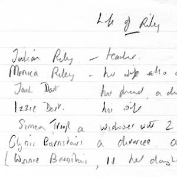
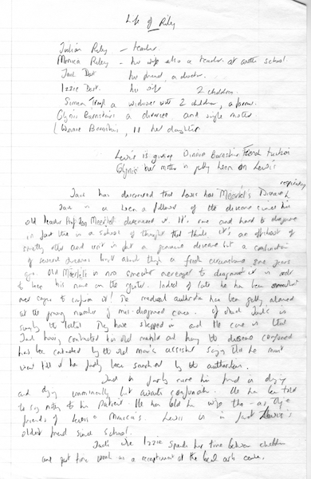
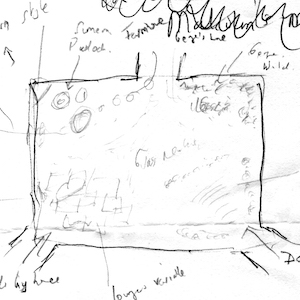
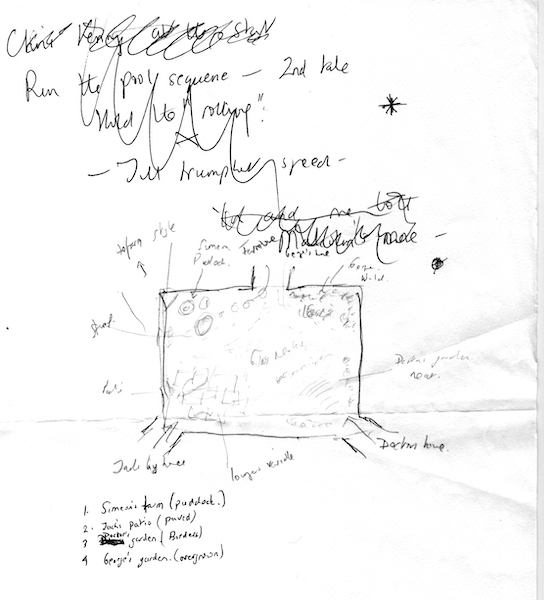
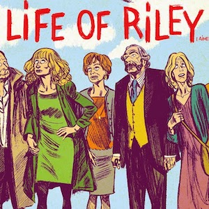
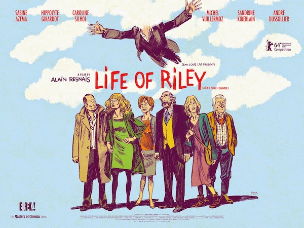

A collection of archive material, posters, rehearsal and production images pertaining to Alan Ayckbourn's *Life of Riley*. The Archive Images page is presented in association with the **[Borthwick Institute for Archives](/)** at the University of York where the Ayckbourn Archive is held. Click on an image to expand.

### Life of Riley (2010)

The title of *Life of Riley* was initially conceived for an earlier, different play. These handwritten notes by Alan Ayckbourn were written circa 2008 and some of the character names would be recycled for his 2009 play *My Wonderful Day*.

*Do not reproduce images without permission of the copyright holder.*

A sketch by Alan Ayckbourn of the set for his world premiere production of Life of Riley at the Stephen Joseph Theatre, Scarborough, during 2010. Note, the in-the-round set is a composite set with several different locations present throughout the play.

*Do not reproduce images without permission of the copyright holder.*

The poster for Alain Resnais's film adaptation of *Life of Riley*, released in 2014, and the final film the auteur completed before his death in March 2014. This was his third Ayckbourn film adaptation and he was already planning a fourth.

**Copyright:** Eureka  
**Holding:** Ayckbourn Digital Archive

*Do not reproduce images without permission of the copyright holder.*     *The Archive Images pages are presented in association with the* ***[Borthwick Institute for Archives](/)*** *at the University of York, where the Ayckbourn Archive is held.*

*All images on this page are copyright of the respective and labelled individual / organisation and should not be reproduced without permission.*  
