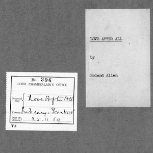
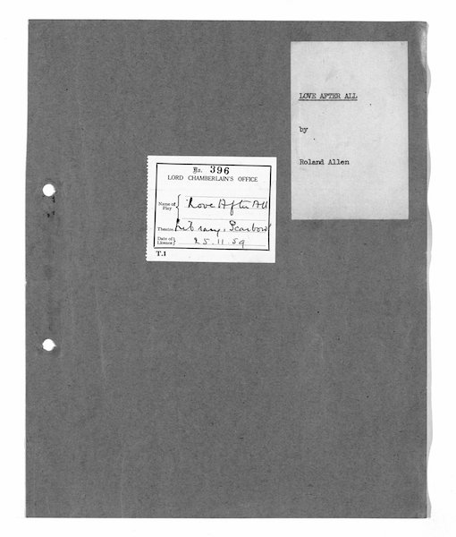
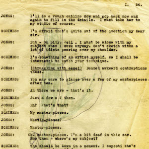
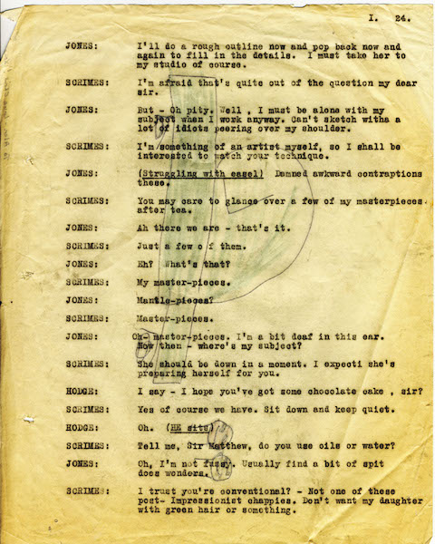
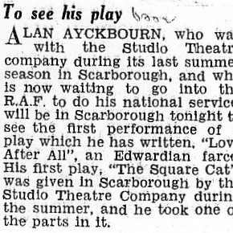
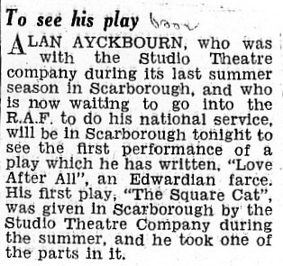
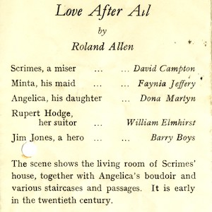
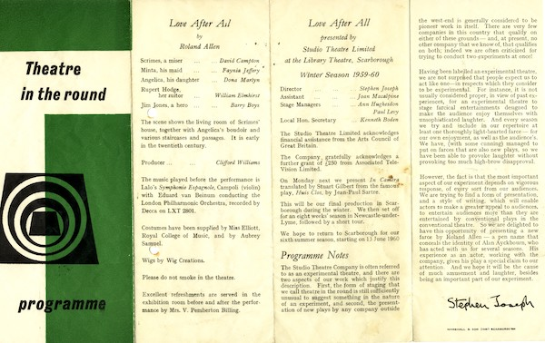

A collection of archive material, posters, rehearsal and production images pertaining to Alan Ayckbourn's *Love After All*. The Archive Images page is presented in association with the **[Borthwick Institute for Archives](/)** at the University of York where the Ayckbourn Archive is held. Click on an image to expand.

### Love After All (1959)

The cover of the only surviving manuscript of *Love After All*, held in the Lord Chamberlain's Collection at the British Library.

*Do not reproduce images without permission of the copyright holder.*

Until 2007, only a single page of an original *Love After All* manuscript was believed to exist - which had been used as drawing paper by one of Alan's sons during the 1960s! In 2007, a complete original manuscript was discovered in the Lord Chamberlain's Collection at the British Library

*Do not reproduce images without permission of the copyright holder.*

An extract from a story in The Stage newspaper about Alan Ayckbourn attending the first night of his new play, *Love After All*.

**Copyright:** The Stage Media Company Ltd  
**Holding:** Borthwick Institute For Archives

*Do not reproduce images without permission of the copyright holder.*

The original programme for the world premiere of *Love After All* at Theatre in the Round at the Library Theatre, Scarborough.

**Copyright:** Studio Theatre Ltd  
**Holding:** Borthwick Institute For Archives

*Do not reproduce images without permission of the copyright holder.*    *The Scene, Archive Images and Research pages are presented in association with the* ***[Borthwick Institute for Archives](/)*** *at the University of York, where the Ayckbourn Archive is held.*

*All images on this page are copyright of the respective and labelled individual / organisation and should not be reproduced without permission.*    *All images are copyright of the respective individual / organisation and should not be reproduced without permission.*
