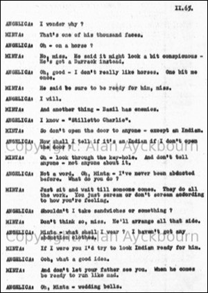

*This page reproduces a scene from the play offering an insight into and a taste of the unpublished work. The dialogue is reproduced in the style of the original including grammatical choices / errors.*

**Act 2** (pages 64 - 65)  
**Minta:** Sssh. I've got a message for you.  
**Angelica:** Who from?  
**Minta:** Ssshhh. From ‘Barefoot Basil - the Daring Desperado’.  
**Angelica:** ‘Barefoot Basil’?  
**Minta:** None other. He's coming for you tonight.  
**Angelica:** Oh - I didn't curl my hair last night.  
**Minta:** Never mind - he'll take you as you are.  
**Angelica:** Where?  
**Minta:** Away from here. Away from this dingy house and your minty old father. Over the hills and far away to his palace.  
**Angelica:** Oh! In Italy?  
**Minta:** Yes, miss - thrilling - isn't it?  
**Angelica:** Did you see him? What's he like when he's not in disguise?  
**Minta:** Well, I didn't actually see him. He's too elusive to show himself yet. I was just washing up when something whistled past my head and I found a knife quivering in my bread-board.  
**Angelica:** Your bread-board? What's that?  
**Minta:** There was a note, miss. It said he'd come tonight - in a new disguise.  
**Minta:** As an Indian - A Hindu Yoga.  
**Angelica:** I wonder why?  
**Minta:** That's one of his thousand faces.  
Angelica: Oh - on a horse?  
**Minta:** No, miss. He said it might look a bit conspicuous - He's got a Darrack instead.  
**Angelica:** Oh, good - I don't really like horses. One bit me once.  
**Minta:** He said you had to be ready for him, Miss.  
**Angelica:** I will.  
**Minta:** And another thing - Basil has enemies.  
**Angelica:** I know - "Stiletto Charlie".  
**Minta:** So don't open the door to anyone - except an Indian.  
**Angelica:** How shall I tell if it's an Indian if I don't open the door?  
**Minta:** Oh - look through the keyhole. And don't tell anyone - not anyone about it.  
**Angelica:** Not a word. Oh, Minta - I've never been abducted before. What do you do?  
**Minta:** Just wait till someone comes. They do all the work. Just scream or don't scream according to how you're feeling.  
**Angelica:** Shouldn't I take sandwiches or something?  
**Minta:** Don't think so, miss. We'll arrange all that side.  
**Angelica:** Minta - what shall I wear? I haven't got any abduction clothes.  
**Minta:** If I were you, I'd try and look Indian ready for him.  
**Angelica:** Ooh, what a good idea.  
**Minta:** And don't let your father see you. When he comes be ready to run like mad.  
**Angelica:** Oh, Minta - wedding bells.

### Notes

This scene is reproduced from the only surviving original manuscript of *Love After All*, which is held at the British Library.  
It offers a brief taste of the tone of *Love After All*, which is one of the few plays Alan Ayckbourn has written which he considers to be a farce (officially because both ***[The Square Cat](/plays/the-square-cat)*** and *Love After All* have been withdrawn, Alan considers only ***[Taking Steps](/plays/taking-steps)*** to be a true farce).  
There is not much to take from *Love After All*, as it is a very conventional play (far more so even than his first play *The Square Cat*) with the plot borrowing heavily from *The Barber Of Seville*.  
However, this scene does offer a glimpse of a recurring character trope in Ayckbourn plays with the bumbling, clueless rural upper class (epitomised by the characters in ***[Mr Whatnot](/plays/mr-whatnot)*** and again used to good effect in ***[The Revengers' Comedies](/plays/the-revengers-comedies)***).  
As the scene demonstrates though, it is the secondary characters which are of far more interest and which drive the narrative. Minta the maid is the most pro-active of the characters and by far the more interesting of the women; whilst the men all come over as relatively stupid - in the case of the aristocratic pig-breeder Hodge, it does afford him some funny lines and he is an early example of the Ayckbourn bore, who can talk about meaningless subjects for an eternity (taken to its logical conclusion with Mark in *Taking Steps* who sends everyone to sleep whenever he begins talking!)  
The scene also makes reference to one of the problems with the play. The kidnap is centred on the characters dressing as Indians with mixed identities thrown into the mix. The racial stereo-typing - from a contemporary perspective - is less problematic with the original production of the play as photos indicate it is more about the costumes as a disguise. However, when the play was revised and performed the following year, the director altered the script for no apparent reason to Chinese characters and the stereotyping - from today's perspective - is far more pronounced and more of an issue.  
This scene, which in 2010 was also used for one of only two public performances of any part of *Love After All* since 1960, is likely to remain the only glimpse of the play for anyone not able to read the script at the British Library.  
*The Scene, Archive Images and Research pages are presented in association with the* ***[Borthwick Institute for Archives](/)*** *at the University of York, where the Ayckbourn Archive is held.*
