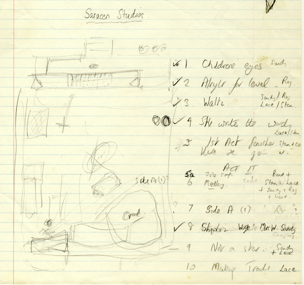
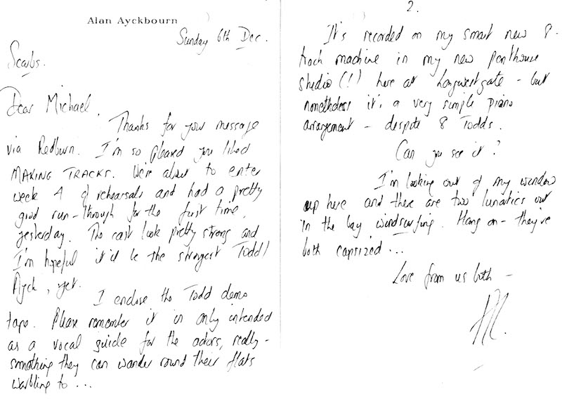
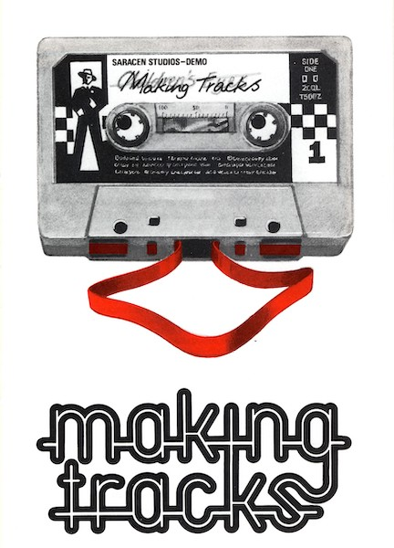
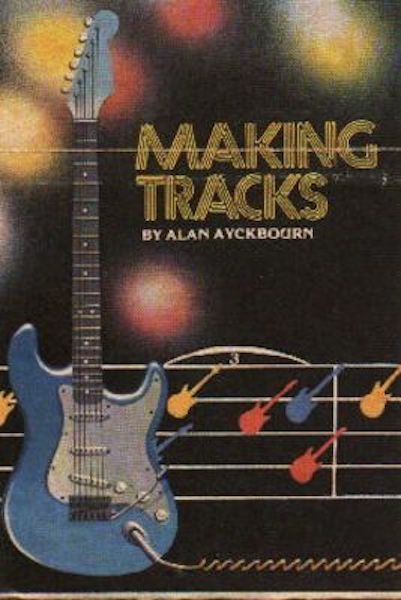

A collection of archive material, posters, rehearsal and production images pertaining to Alan Ayckbourn's *Making Tracks*. The Archive Images page is presented in association with the **[Borthwick Institute for Archives](/)** at the University of York where the Ayckbourn Archive is held. Click on an image to expand.

### Making Tracks (1981)

Alan Ayckbourn's sketch for the set of the world premiere of *Making Tracks* at the Stephen Joseph Theatre in the Round, Scarborough, in 1981. It shows the split of the stage with the recording studio taking up the majority of the lower part of the diagram with the studio's sound box at the top. The song list for the production is listed on the right.

**Copyright:** Haydonning Ltd  
**Holding:** Borthwick Institute for Archives

*Do not reproduce images without permission of the copyright holder.*

Correspondence from Alan Ayckbourn to his London producer Michael Codron relating to *Making Tracks*. Of particular note is Alan talking about his personal new 8 track recorder for his home studio - which is now the office of his Archivist. It should be noted, Alan's personal recording studio was far in advance of anything at the Scarborough theatre and most of the sound plots for his productions were recorded in his home studio from the 1970s to 1990s.

**Copyright:** Haydonning Ltd  
**Holding:** Borthwick Institute for Archives

*Do not reproduce images without permission of the copyright holder.*

The poster for the world premiere production of *Making Tracks* at the Stephen Joseph Theatre in the Round, Scarborough, in 1981.

**Copyright:** Scarborough Theatre Trust  
**Holding:** Borthwick Institute for Archives

*Do not reproduce images without permission of the copyright holder.*

A rarely seen poster design for the London premiere of *Making Tracks* at the Greenwich Theatre in 1983.

**Copyright:** Greenwich Theatre  
**Holding:** Ayckbourn Digital Archive

*Do not reproduce images without permission of the copyright holder.*  
*The Archive Images pages are presented in association with the* ***[Borthwick Institute for Archives](/)*** *at the University of York, where the Ayckbourn Archive is held.*

*All images on this page are copyright of the respective and labelled individual / organisation and should not be reproduced without permission.*  
