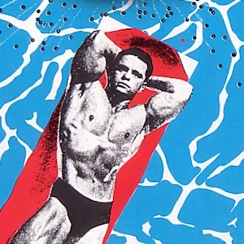
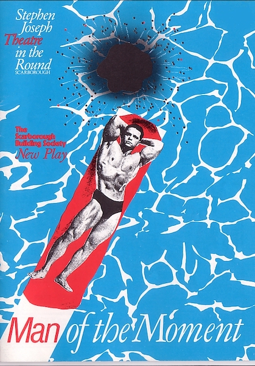
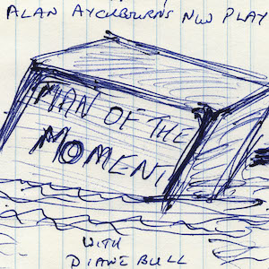
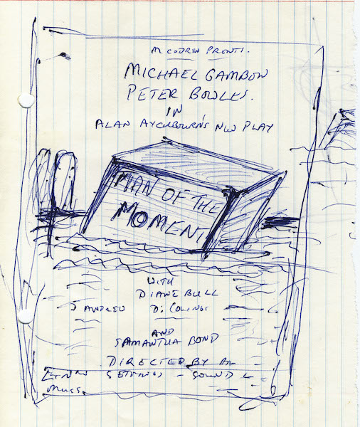
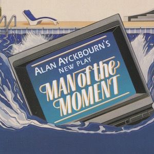
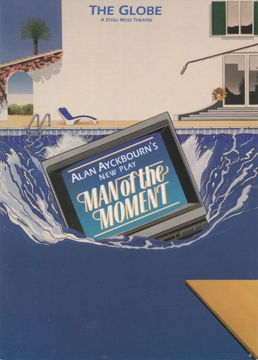

A collection of archive material, posters, rehearsal and production images pertaining to Alan Ayckbourn's *Man of the Moment*. The Archive Images page is presented in association with the **[Borthwick Institute for Archives](/)** at the University of York where the Ayckbourn Archive is held. Click on an image to expand.

### Man of the Moment (1988)

The poster for the world premiere of *Man of the Moment* at the Stephen Joseph Theatre in the Round, Scarborough, in 1988. Alan Ayckbourn was reported less than impressed he wasn't credited and that it appeared the Scarborough Building Society had written the play!

**Copyright:** Scarborough Theatre Trust  
**Holding:** Borthwick Institute for Archives

*Do not reproduce images without permission of the copyright holder.*

Alan Ayckbourn's sketch for his suggested poster for the West End premiere of *Man of the Moment* at the Globe Theatre in 1990.

*Do not reproduce images without permission of the copyright holder.*

The actual poster for the West End premiere of *Man of the Moment* at The Globe Theatre in 1990.

**Copyright:** Michael Codron Productions  
**Holding:** Borthwick Institute for Archives

*Do not reproduce images without permission of the copyright holder.*     *The Archive Images pages are presented in association with the* ***[Borthwick Institute for Archives](/)*** *at the University of York, where the Ayckbourn Archive is held.*

*All images on this page are copyright of the respective and labelled individual / organisation and should not be reproduced without permission.*  
