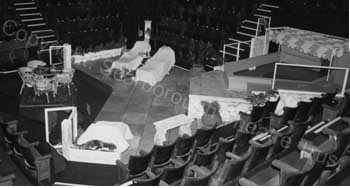
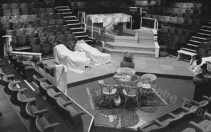
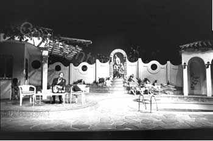

It is impossible to consider *Man Of The Moment* as a play without at least touching upon its set, which is one of the play's most obvious challenges and considerations.

Not that that the set did not have its own challenges as the designer Michael Holt recalls.

*“Because \[Way Upstream\] was on a canal, the water could be muddy, so what looked 10ft deep was actually about nine inches. This \[Man Of The Moment\] is a swimming pool so the water has to be clean, and deep enough to allow the actors to actually swim.”*

Michael had to contend with several pertinent factors, not least the pool had to come apart as *Man Of The Moment* was running in repertory and had to be quickly and easily dismantled and assembled once a week. Other issues to be considered were water pressure, a structure strong enough not to split, fire regulations and the pool being able to go far enough off-stage that it gave the illusion it was far larger than it actually appeared. The pool was constructed by the theatre’s master carpenter, but because of the awkward shape of the pool - thanks to the vom and the need for it to go into the limited back stage area - the lining had to be specially designed on a computer (a relative rarity bearing in mind this was in 1988) to create the required irregular shape.

It is testament to the designer and the builders’ skills that there is no record of any problems with the pool during its run in Scarborough.

When the play opened in the West End, it was at The Globe Theatre, a proscenium arch venue which theoretically made the design a little simpler. This version was designed by Roger Glossop, who had the pool at one side of the stage, running into the wings (bottom image). It actually ran about 15ft onto the stage but could not come any further as the weight would have been too much to bear. This was the major issue with the West End production. The pool took 5,000 gallons of water to fill and weighed approximately 36 tonnes. As a result, the stage and the pool had to be structurally underpinned so as to support the immense weight, something the Globe’s stage would never have been designed to bear.

The final pool structure was 20ft by 10ft with a depth of almost 5ft; it took 36 hours to warm the water to a comfortable level. The pool was filled by the Fire Brigade - something important to consider, having built a pool, how are you going to fill it and, equally important, get rid of the water given that it is not possible or legal just to drain all the water out into the street.

*The original production set designed by Michael Holt.*  
*Copyright: Scarborough Theatre Trust*

*The original production set designed by Michael Holt.*  
*Copyright: Scarborough Theatre Trust*

*The West End set designed by Roger Glossop.*  
*Copyright: John Haynes*

Another important element of the design, which unfortunately cannot be seen from photographs of the set, was the ingenious inclusion of an air lock into the pool. This allowed the actors playing Vic and Sharon to remain submerged for a substantial period of time by putting their heads into the hidden airlock, allowing them to breathe, while giving the impression to the audience their bodies were still submerged in the pool.

The London set, which was obviously more realistic than the Scarborough set, gave more a sense of the villa than was actually possible in the round and stands as one of the most impressive of the West End productions of Alan’s plays. Its London production was obviously also far more successful in its conception than Alan’s previous famed water play, *Way Upstream*, whose fibre-glass tank had split at the National Theatre causing gallons of water to flood the floors beneath.
