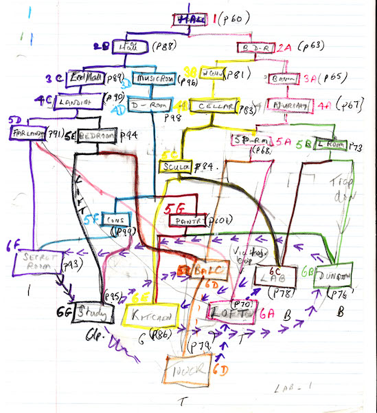
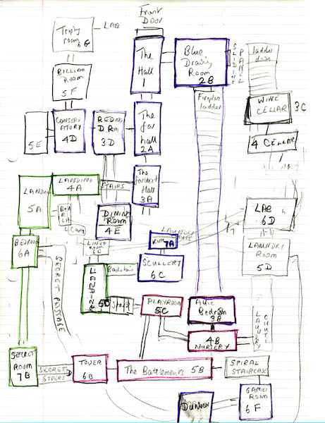
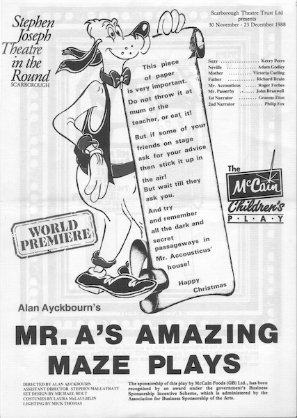
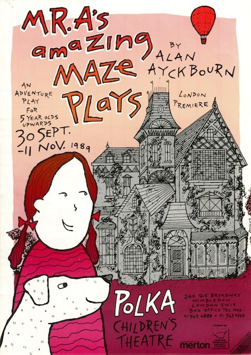
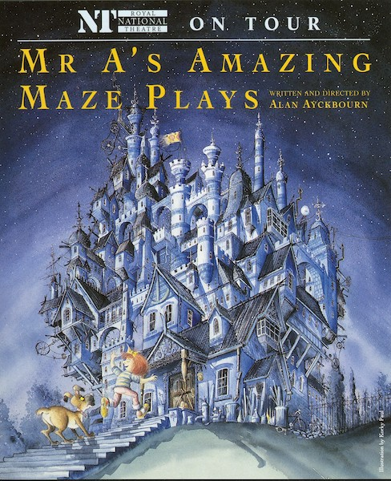

A collection of archive material, posters, rehearsal and production images pertaining to Alan Ayckbourn's *Mr A's Amazing Maze Plays*. The Archive Images page is presented in association with the **[Borthwick Institute for Archives](/)** at the University of York where the Ayckbourn Archive is held. Click on an image to expand.

### Mr A's Amazing Maze Plays (1988)

*Mr A's Amazing Plays* has a complex structure in which the path through Mr A's house is determined by the audience. This is the earliest surviving sketch by the playwright of the play's second act structure and all the options for moving through the house.

**Copyright:** Haydonning Ltd  
**Holding:** Borthwick Institute for Archives

*Do not reproduce images without permission of the copyright holder.*

A more refined sketch of the structure for *Mr A's Amazing Maze Plays* by Alan Ayckbourn, more clearly illustrating the rooms of the house and the various options they present to enter and leave.

**Copyright:** Haydonning Ltd  
**Holding:** Borthwick Institute for Archives

*Do not reproduce images without permission of the copyright holder.*

Surprisingly the world premiere production of *Mr A's Amazing Maze Plays* had neither a poster nor a programme. All that was produced was this sheet of A4 paper with basic details that was used by the audience to help indicate their choices when hands were raised during the course of the play.

**Copyright:** Scarborough Theatre Trust  
**Holding:** Borthwick Institute for Archives

*Do not reproduce images without permission of the copyright holder.*

The London premiere of *Mr A's Amazing Maze Plays* is a little known production by Polka Theatre which took place in 1989. This is the programme cover for the production.

**Copyright:** Polka Theatre  
**Holding:** Borthwick Institute for Archives

*Do not reproduce images without permission of the copyright holder.*

In 1993, the National Theatre revived *Mr A's Amazing Maze Plays* and commissioned the now famed illustrator Korky Paul to create the poster. This remains to this day one of the most memorable posters from an Ayckbourn production.

**Copyright:** National Theatre  
**Holding:** Borthwick Institute for Archives

*Do not reproduce images without permission of the copyright holder.*  
*The Archive Images pages are presented in association with the* ***[Borthwick Institute for Archives](/)*** *at the University of York, where the Ayckbourn Archive is held.*

*All images on this page are copyright of the respective and labelled individual / organisation and should not be reproduced without permission.*  
