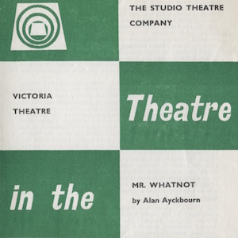
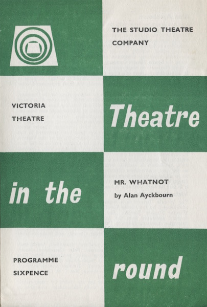
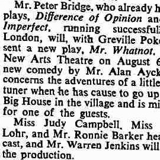
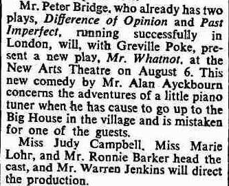
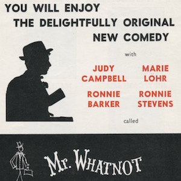
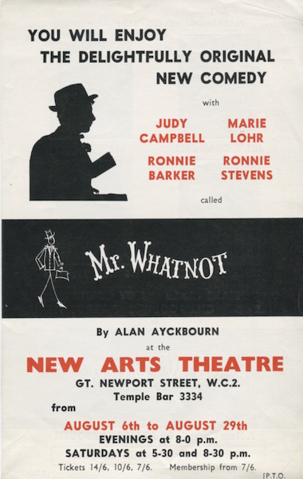
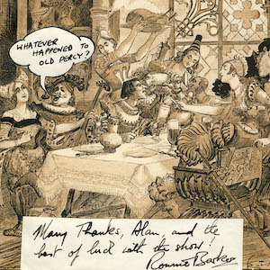
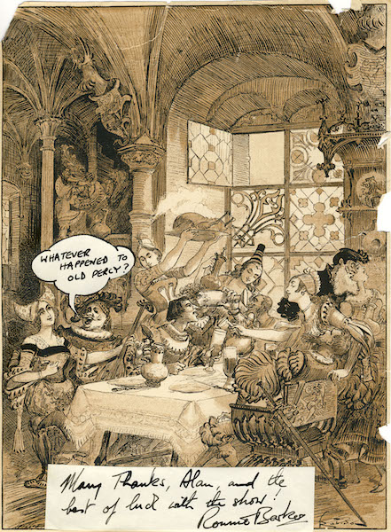

A collection of archive material, posters, rehearsal and production images pertaining to Alan Ayckbourn's *Mr Whatnot*. The Archive Images page is presented in association with the **[Borthwick Institute for Archives](/)** at the University of York where the Ayckbourn Archive is held. Click on an image to expand.

### Mr Whatnot (1963)

The programme cover for the world premiere of *Mr Whatnot* at the Victoria Theatre, Stoke-on-Trent, in 1963.

**Copyright:** Haydonning Ltd  
**Holding:** Borthwick Institute For Archives

*Do not reproduce images without permission of the copyright holder.*

The Times announcement that *Mr Whatnot* had been optioned for the West End by Peter Bridge, published on 22 July 1964.

**Copyright:** Times Newspapers Ltd  
**Holding:** Borthwick Institute For Archives

*Do not reproduce images without permission of the copyright holder.*

A flyer for the West End premiere of *Mr Whatnot* at the New Arts Theatre in 1964.

**Copyright:** To be confirmed  
**Holding:** Borthwick Institute For Archives

*Do not reproduce images without permission of the copyright holder.*

Ronnie Barker's first night telegram to Alan Ayckbourn for the opening of *Mr Whatnot* in the West End in 1964.

**Copyright:** Haydonning Ltd  
**Holding:** Borthwick Institute For Archives

*Do not reproduce images without permission of the copyright holder.*  
*The Archive Images page is presented in association with the* ***[Borthwick Institute for Archives](/)*** *at the University of York, where the Ayckbourn Archive is held.*

*All images on this page are copyright of the respective and labelled individual / organisation and should not be reproduced without permission.*  
