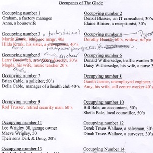
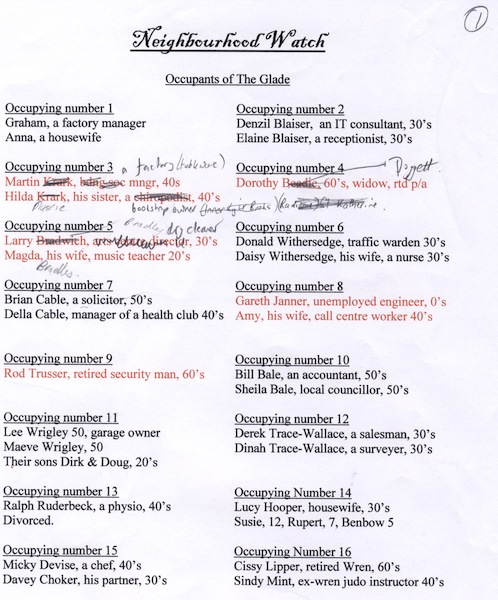
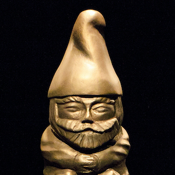
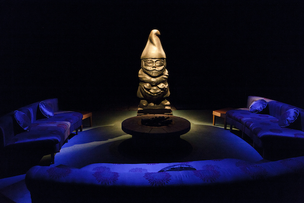
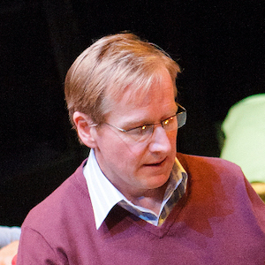
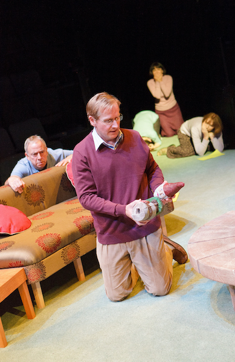
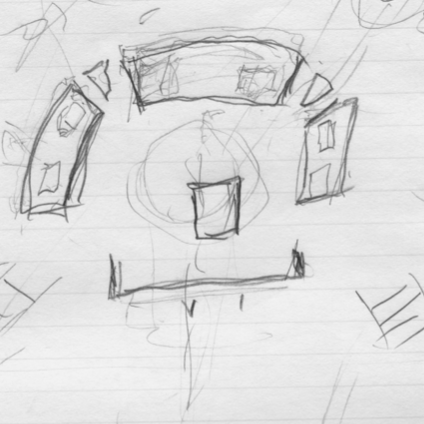
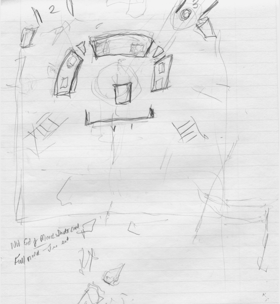

A collection of archive material, posters, rehearsal and production images pertaining to Alan Ayckbourn's *The Girl Next Door*. The Archive Images page is presented in association with the **[Borthwick Institute for Archives](/)** at the University of York where the Ayckbourn Archive is held. Click on an image to expand.

### Neighbourhood Watch (2011)

Early notes by Alan Ayckbourn for *Neighbourhood Watch* detailing the residents of The Glade - many of whom are unseen and referenced in the play. Many names were altered by Alan as these notes show.

*Do not reproduce images without permission of the copyright holder.*

Monty the gnome in all his glory for the finale of the world premiere of *Neighbourhood Watch* at the Stephen Joseph Theatre, Scarborough, in 2012. Monty was designed by Pip Leckenby and created by Michael Roberts.

**Photography:** Karl Andre (© Karl Andre)  
**Holding:** Ayckbourn Digital Archive

*Do not reproduce images without permission of the copyright holder.*

A pivotal scene from the world premiere of *Neighbourhood Watch* at the Stephen Joseph Theatre, Scarborough, in 2012.

**Photographer:** Karl Andre (© Karl Andre)  
**Holding:** Borthwick Institute for Archives

*Do not reproduce images without permission of the copyright holder.*

Alan Ayckbourn's pencil sketch of the end-stage set for *Neighbourhood Watch* for when it transferred from in-the-round at Scarborough to the 59E59 Theatres, New York, and the Tricycle Theatre, London.

*Do not reproduce images without permission of the copyright holder.*    *The Archive Images pages are presented in association with the* ***[Borthwick Institute for Archives](/)*** *at the University of York, where the Ayckbourn Archive is held.*

*All images on this page are copyright of the respective and labelled individual / organisation and should not be reproduced without permission.*  
