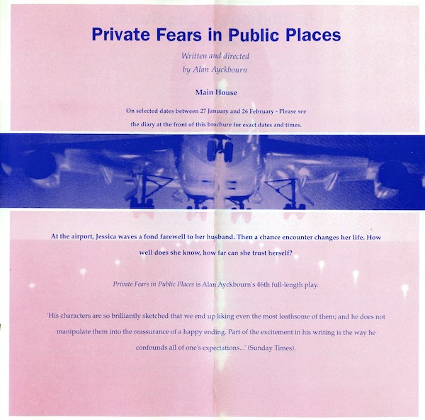
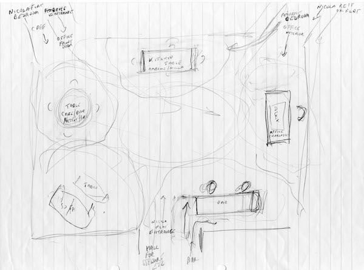
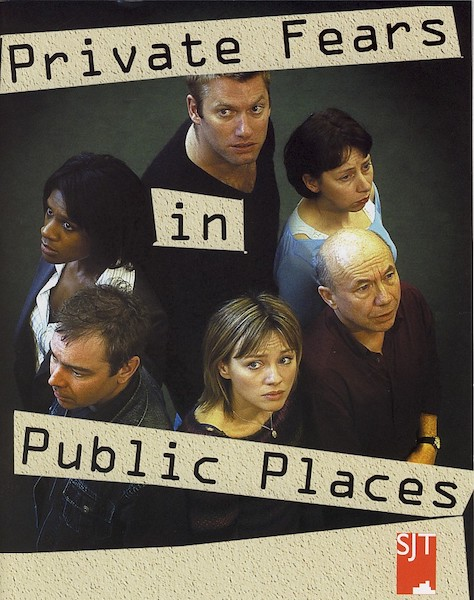
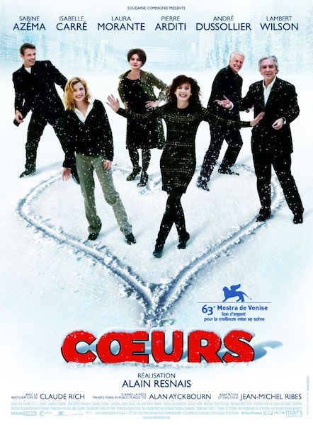
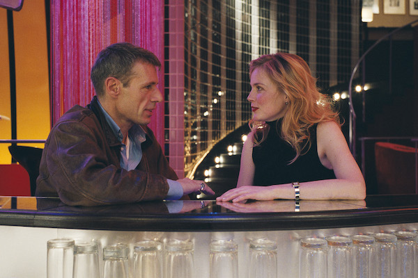
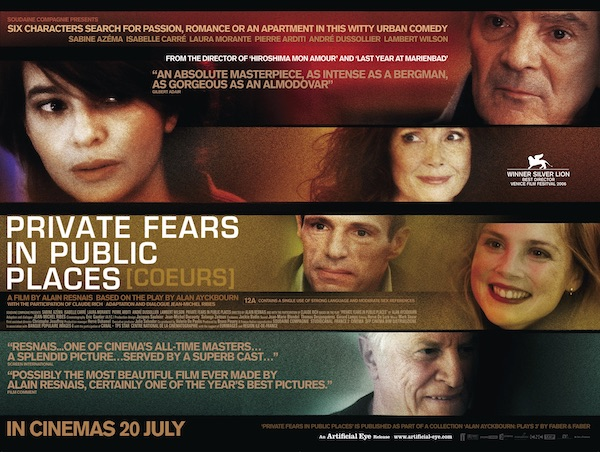

A collection of archive material, posters, rehearsal and production images pertaining to Alan Ayckbourn's *Private Fears in Public Places*. The Archive Images page is presented in association with the **[Borthwick Institute for Archives](/)** at the University of York where the Ayckbourn Archive is held. Click on an image to expand.

### Private Fears in Public Places (2004)

In 1994, the Stephen Joseph Theatre in the Round announced the title of Alan Ayckbourn's latest play as *Private Fears in Public Places* - on the day the brochure went to print, Alan contacted the theatre to say he was going to write a completely different play. Too late to be altered, the brochure was sent out with details of *Private Fears in Public Places*.

**Copyright:** Scarborough Theatre Trust  
**Holding:** Borthwick Institute for Archives

*Do not reproduce images without permission of the copyright holder.*

Alan Ayckbourn's sketch for the layout of the set for the in-the-round world premiere of *Private Fears in Public Places* at the Stephen Joseph Theatre in 2004.

**Copyright:** Haydonning Ltd  
**Holding:** Borthwick Institute for Archives

*Do not reproduce images without permission of the copyright holder.*

The original poster for the world premiere production of *Private Fears in Public Places* at the Stephen Joseph Theatre's Scarborough, in 2004.

**Copyright:** Scarborough Theatre Trust  
**Holding:** Borthwick Institute for Archives

*Do not reproduce images without permission of the copyright holder.*

The poster for the 2006 film premiere of Alain Resanis's *Coeurs* (translated as Hearts), his award-winning French language adaption of *Private Fears in Public Places*.

**Copyright:** To be confirmed  
**Holding:** Borthwick Institute for Archives

*Do not reproduce images without permission of the copyright holder.*

Lambert Wilson & Isabelle Carré in Alain Resnais's film adaptation *Coeurs*.

**Photographer:** Sylvie Biscioni (© TBC)  
**Holding:** Ayckbourn Digital Archive

*Do not reproduce images without permission of the copyright holder.*

The UK poster for Alain Resnais's film adaptation of *Private Fears in Public Places*; the title was restored for the UK release from the French title of *Coeurs*.

**Copyright:** To be confirmed  
**Holding:** Borthwick Institute for Archives

*Do not reproduce images without permission of the copyright holder.*  
*The Archive Images pages are presented in association with the* ***[Borthwick Institute for Archives](/)*** *at the University of York, where the Ayckbourn Archive is held.*

*All images on this page are copyright of the respective and labelled individual / organisation and should not be reproduced without permission.*  
