A collection of archive material, posters, rehearsal and production images pertaining to Alan Ayckbourn's *Relatively Speaking*. The Archive Images page is presented in association with the **[Borthwick Institute for Archives](/)** at the University of York where the Ayckbourn Archive is held. Click on an image to expand.

### Relatively Speaking (1965)

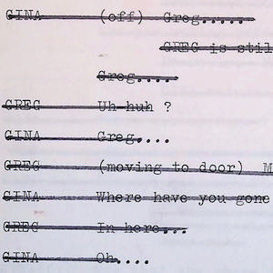

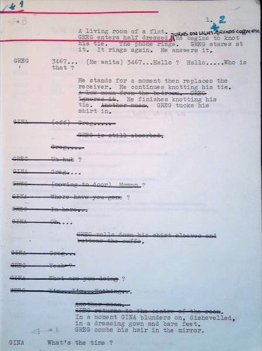

The first page of director Stephen Joseph's production manuscript for *Meet My Father* at Theatre in the Round at the Library Theatre, Scarborough, in 1965. Note the substantive cuts by Stephen Joseph on this page alone, repeated throughout the manuscript.

**Copyright:** Haydonning Ltd  
**Holding:** Private Collection

*Do not reproduce images without permission of the copyright holder.*

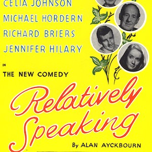

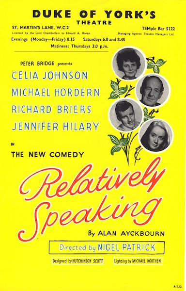

A flyer for the West End premiere of *Relatively Speaking* at the Duke of York's Theatre in 1967; this would prove to be Alan Ayckbourn's breakout play.

**Copyright:** To be confirmed  
**Holding:** Borthwick Institute For Archives

*Do not reproduce images without permission of the copyright holder.*

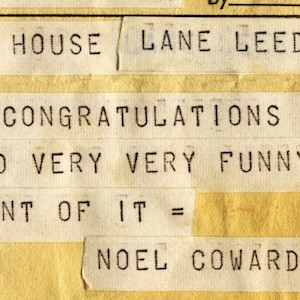

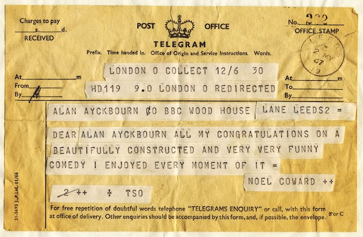

Noël Coward's telegram to Alan Ayckbourn congratulating him on the West End success of *Relatively Speaking*. Alan initially thought it was fake and threw it away…

**Copyright:** Haydonning Ltd  
**Holding:** Borthwick Institute For Archives

*Do not reproduce images without permission of the copyright holder.*

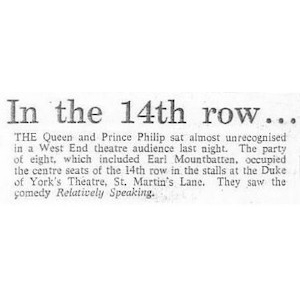

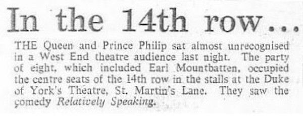

A Daily Mail report from 23 May 1967 about Queen Elizabeth II making her first visit to an Ayckbourn play with *Relatively Speaking*.

**Copyright:** Haydonning Ltd  
**Holding:** Borthwick Institute For Archives

*Do not reproduce images without permission of the copyright holder.*

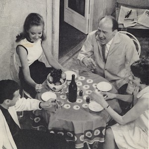

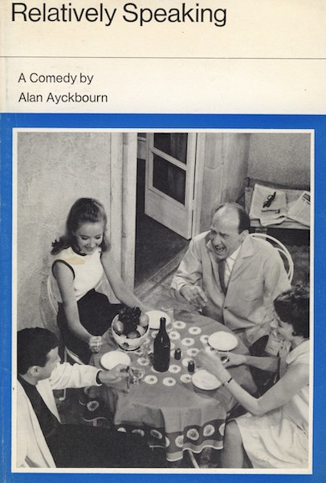

The cover for the first Ayckbourn play to be published. Although Evans received the original manuscript for *Relatively Speaking* in 1967, it took two years to publish the play and the company destroyed the original manuscript in the process!

**Copyright:** Evans Publishing  
**Holding:** Borthwick Institute For Archives

*Do not reproduce images without permission of the copyright holder.*

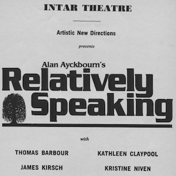

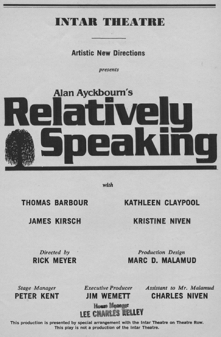

The interior for the Playbill for the New York premiere of *Relatively Speaking* at the Inter Theatre in 1982.

**Copyright:** Playbill  
**Holding:** Borthwick Institute for Archives

*Do not reproduce images without permission of the copyright holder.*

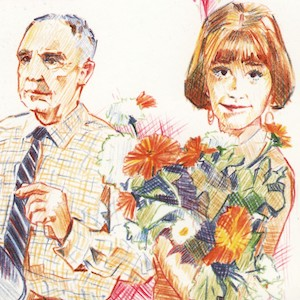

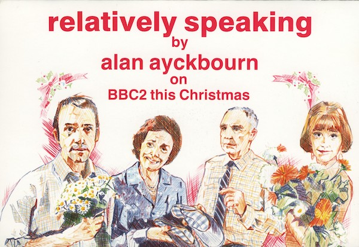

A publicity postcard for the BBC's second television adaptation of *Relatively Speaking* broadcast on Christmas Eve 1989. The cast - artistically rendered here - was Michael Malone, Gwen Watford, Nigel Havers & Imogen Stubbs.

**Copyright:** BBC  
**Holding:** Borthwick Institute for Archives

*Do not reproduce images without permission of the copyright holder.*

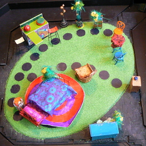

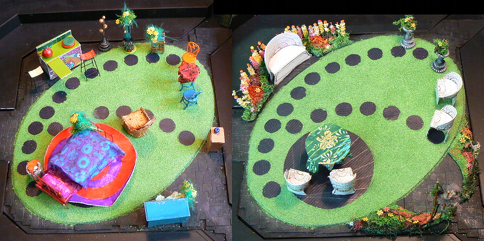

The model box for the sets for Alan Ayckbourn's 2007 revival of *Relatively Speaking* at the Stephen Joseph Theatre, Scarborough. The design for the production was by Alan's frequent collaborator, Michael Holt.

**Copyright:** Michael Holt  
**Holding:** Ayckbourn Digital Archive

*Do not reproduce images without permission of the copyright holder.*  
*The Scene, Archive Images and Research pages are presented in association with the* ***[Borthwick Institute for Archives](/)*** *at the University of York, where the Ayckbourn Archive is held.*

*All images on this page are copyright of the respective and labelled individual / organisation and should not be reproduced without permission.*  
