A collection of archive material, posters, rehearsal and production images pertaining to Alan Ayckbourn's *The Norman Conquests*. The Archive Images page is presented in association with the **[Borthwick Institute for Archives](/)** at the University of York where the Ayckbourn Archive is held. Click on an image to expand.

### The Norman Conquests (1973)

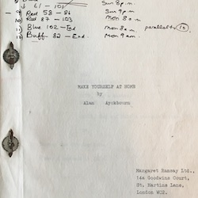

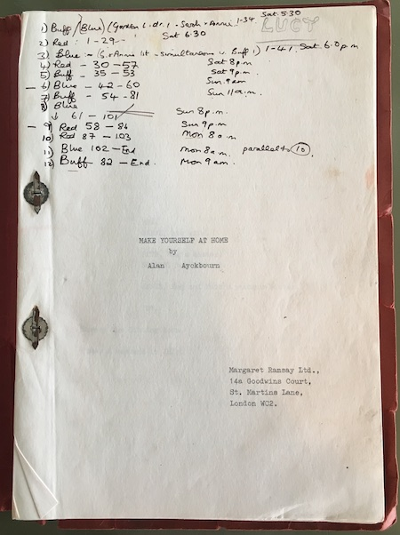

When *The Norman Conquests* premiered at Theatre in the Round at the Library Theatre, Scarborough, in 1973, two of the plays had different titles (and it was not actually called *The Norman Conquests* then). This is an original manuscript for *Make Yourself At Home* (later retitled *Living Together*) with Alan Ayckbourn's notes on the cover.

*Do not reproduce images without permission of the copyright holder.*

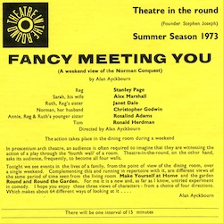

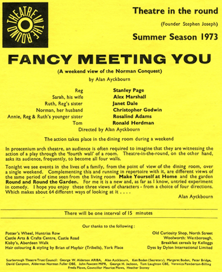

The 'programme / playbill' for the world premiere of *Fancy Meeting You* (later retitled *Table Manners*) at Theatre in the Round at the Library Theatre. It featured only cast and company details alongside a brief introduction by Alan Ayckbourn. Note how the trilogy was not originally known or advertised as *The Norman Conquests*. The reverse side featured the actors' biographies.

**Copyright:** Scarborough Theatre Trust  
**Holding:** Borthwick Institute for Archives

*Do not reproduce images without permission of the copyright holder.*

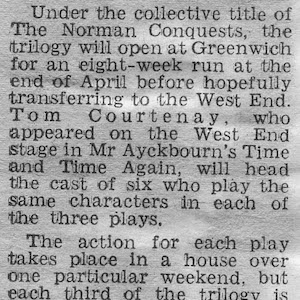

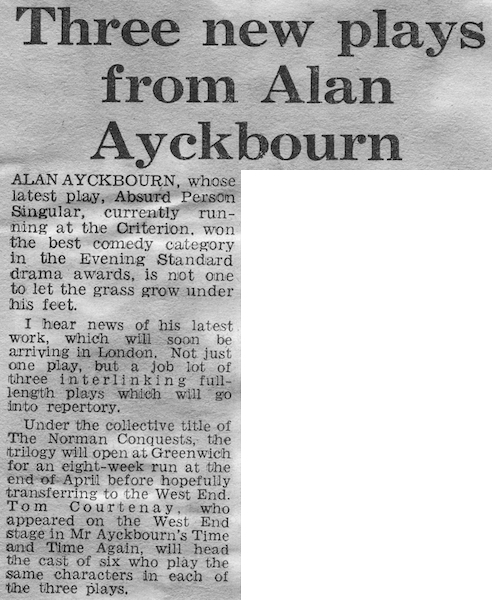

The earliest recorded public mention of the trilogy as *The Norman Conquests* in an article published in The Evening Standard on 24 January 1974 - an extract from which is published here. Prior to this, the trilogy was just known by the play's individual titles.

**Copyright:** Evening Standard Ltd  
**Holding:** Borthwick Institute for Archives

*Do not reproduce images without permission of the copyright holder.*

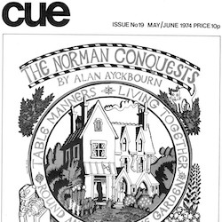

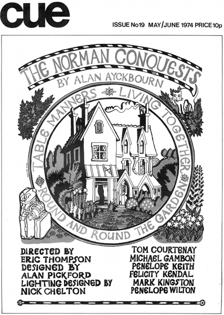

*The Norman Conquests* only gained its famous trilogy title when it transferred to London in 1974. It initially premiered at the Greenwich Theatre (programme cover above), directed by Alan Ayckbourn, before transferring into the West End.

**Copyright:** Greenwich Theatre  
**Holding:** Borthwick Institute For Archives

*Do not reproduce images without permission of the copyright holder.*

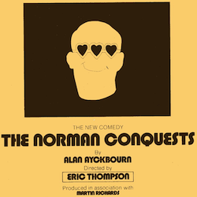

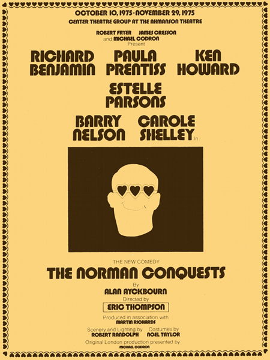

Following its success in London, it was quickly decided to transfer *The Norman Conquests* to Broadway via Los Angeles with Eric Thompson directing the trilogy fresh from the West End. This is the playbill cover for the L.A. premiere which stands as one of the strangest poster images for the trilogy ever conceived.

**Copyright:** To be confirmed  
**Holding:** Borthwick Institute For Archives

*Do not reproduce images without permission of the copyright holder.*

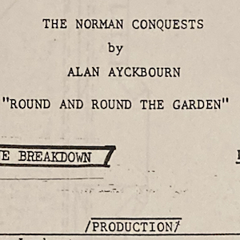

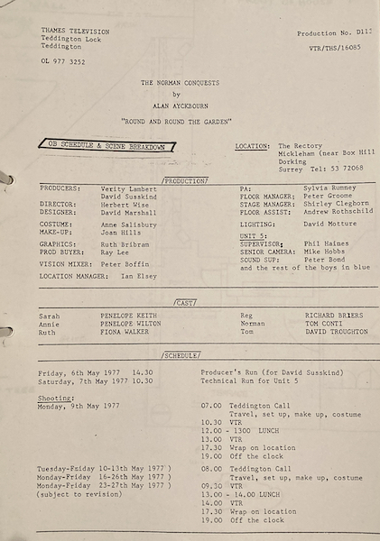

A call sheet for filming for the 1977 Thames Television adaptation of *The Norman Conquests* trilogy. This includes the detail that the exterior filming took place in Mickleham, Surrey.

**Copyright:** Thames Television  
**Holding:** Borthwick Institute For Archives

*Do not reproduce images without permission of the copyright holder.*

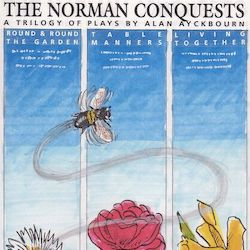

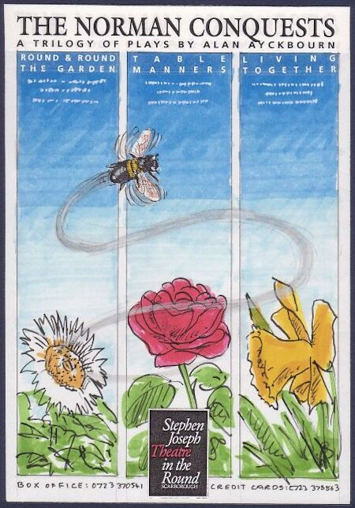

During 1993, Alan Ayckbourn revived *The Norman Conquests* at the Stephen Joseph Theatre in the Round, Scarborough, directing the trilogy for the first time since its world premiere in 1973. This is one of a number of unused concepts for the poster based on three images (one for each play).

**Copyright:** Scarborough Theatre Trust  
**Holding:** The Bob Watson Archive

*Do not reproduce images without permission of the copyright holder.*

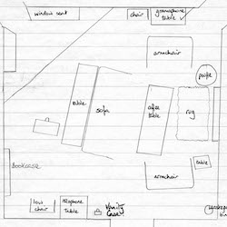

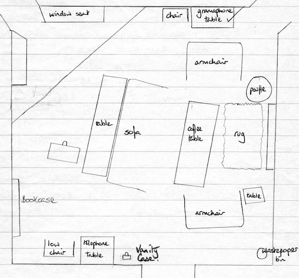

A sketch by Alan Ayckbourn illustrating the layout for his in-the-round revival of *Living Together* at the Stephen Joseph Theatre in the Round in 1993. Note the reference to the 'gramophone'; Alan believes all his plays are period pieces and should always be set in the era when they were written.

*Do not reproduce images without permission of the copyright holder.*    *The Scene and Archive Images pages are presented in association with the* ***[Borthwick Institute for Archives](/)*** *at the University of York, where the Ayckbourn Archive is held.*

*All images on this page are copyright of the respective and labelled individual / organisation and should not be reproduced without permission.*  
