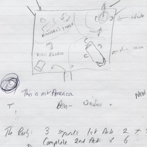
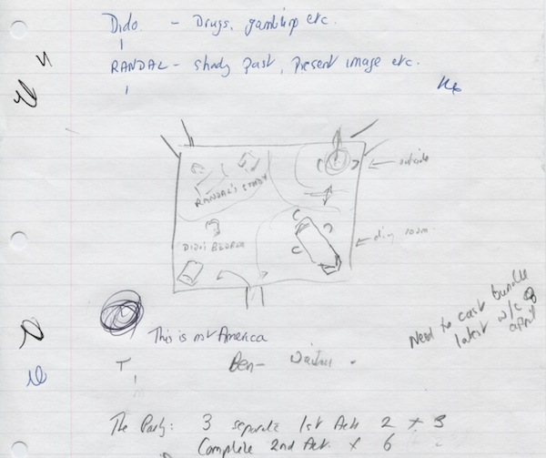
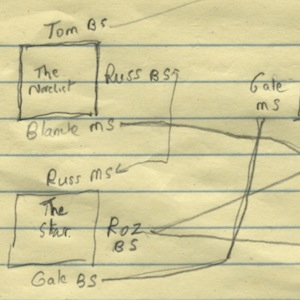
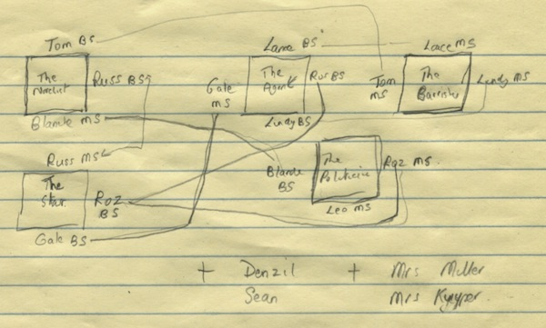
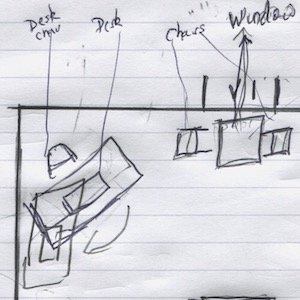
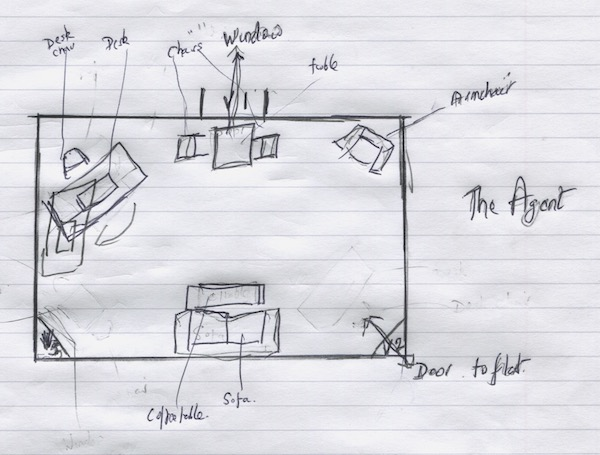
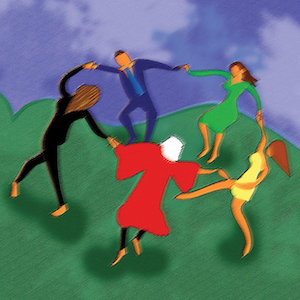
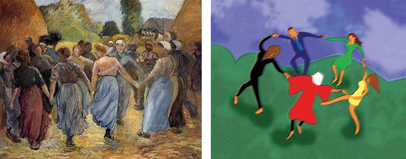

A collection of archive material, posters, rehearsal and production images pertaining to Alan Ayckbourn's *Roundelay*. The Archive Images page is presented in association with the **[Borthwick Institute for Archives](/)** at the University of York where the Ayckbourn Archive is held. Click on an image to expand.

### Roundelay (2014)

Very early notes by Alan Ayckbourn for the play which would become *Roundelay*. At this point, the play was called *The Party* and although it featured an unusual structure, it does not appear to have had the random elements of *Roundelay*.

*Do not reproduce images without permission of the copyright holder.*

A diagram by Alan Ayckbourn showing how the *Roundelay* plays intersect with each other and the connections between the characters.

*Do not reproduce images without permission of the copyright holder.*

A sketch of the proposed set layout by Alan Ayckbourn for *The Agent* one act play within *Roundelay*. This was provided for the world premiere of the play at the Stephen Joseph Theatre, Scarborough, in 2014.

*Do not reproduce images without permission of the copyright holder.*

The poster for the world premiere of *Roundelay* (right) at the Stephen Joseph Theatre in 2014 did not quite reproduce what the playwright imagined. His brief was an image inspired by Pissarro's painting *La Ronde* (left). As can be seen, the result was not as satisfying as it might have been…

**Copyright (poster):** Scarborough Theatre Trust  
**Holding:** The Bob Watson Archive

*Do not reproduce images without permission of the copyright holder.*    *The Scene and Archive Images pages are presented in association with the* ***[Borthwick Institute for Archives](/)*** *at the University of York, where the Ayckbourn Archive is held.*

*All images on this page are copyright of the respective and labelled individual / organisation and should not be reproduced without permission.*  
