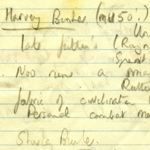
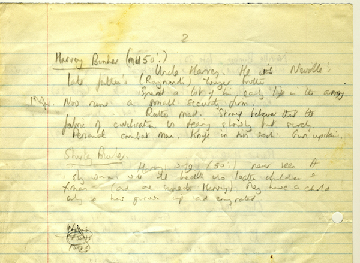
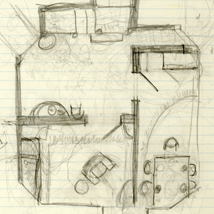
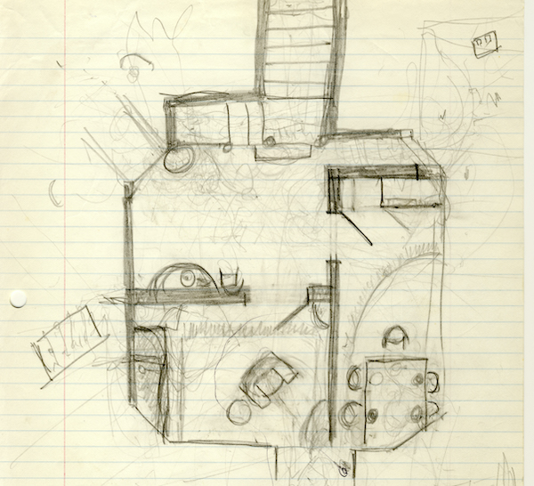
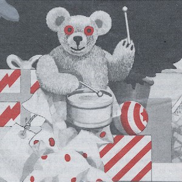
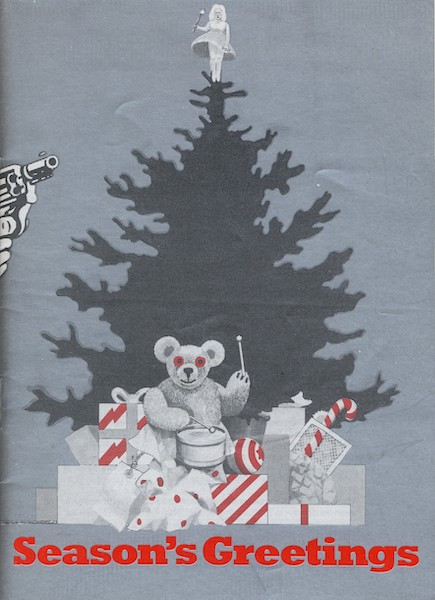

A collection of archive material, posters, rehearsal and production images pertaining to Alan Ayckbourn's *Season's Greetings*. The Archive Images page is presented in association with the **[Borthwick Institute for Archives](/)** at the University of York where the Ayckbourn Archive is held. Click on an image to expand.

### Season's Greetings (1980)

The Ayckbourn Archive at the Borthwick Institute for Archives at the University of York holds a selection of handwritten notes by Alan Ayckbourn for *Season's Greetings*. Here we see character notes for Uncle Harvey and his wife, Shirley, who - although unseen in the play - was heard in the original production of the play before the playwright removed her character completely.

*Do not reproduce images without permission of the copyright holder.*

Alan Ayckbourn's original hand-drawn sketch for the layout of the set for *Season's Greetings* taken from notes held in the Ayckbourn Archive at the Borthwick Institute for Archives. Despite being his first sketch, it is practically the same as the final plan.

*Do not reproduce images without permission of the copyright holder.*

At the time of its production, Season's Greetings was considered Alan Ayckbourn's 25th full-length play (it's now considered his 26th play) and - to mark this - the programmes were coloured with a silver ink. This would have been a great expense at the time given the printing processes available pre-digital.

**Copyright:** Scarborough Theatre Trust  
**Holding:** Borthwick Institute for Archives

*Do not reproduce images without permission of the copyright holder.*     *The Archive Images pages are presented in association with the* ***[Borthwick Institute for Archives](/)*** *at the University of York, where the Ayckbourn Archive is held.*

*All images on this page are copyright of the respective and labelled individual / organisation and should not be reproduced without permission.*  
