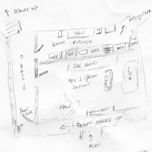
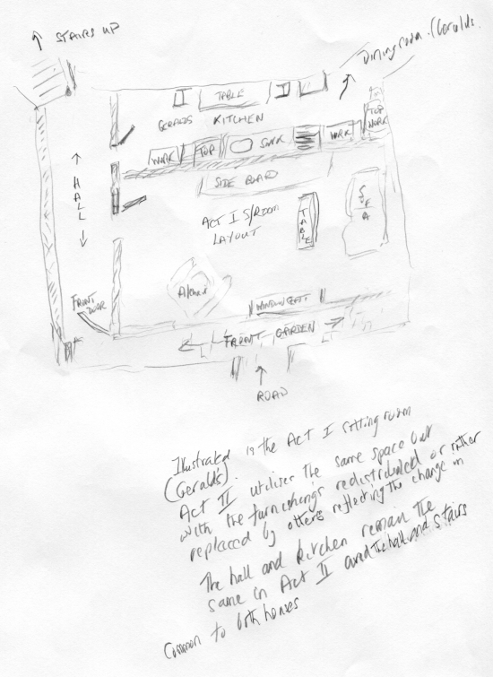
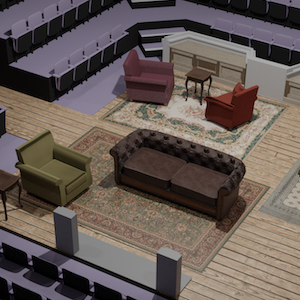
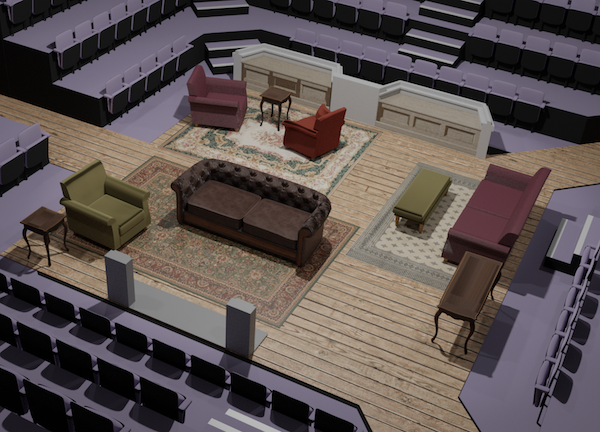
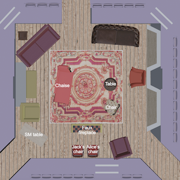
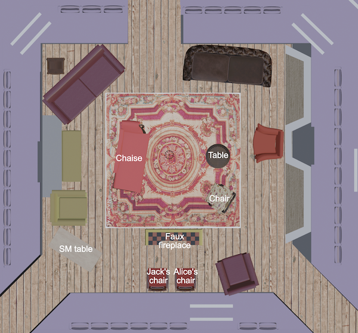
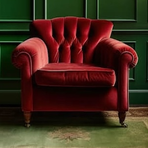
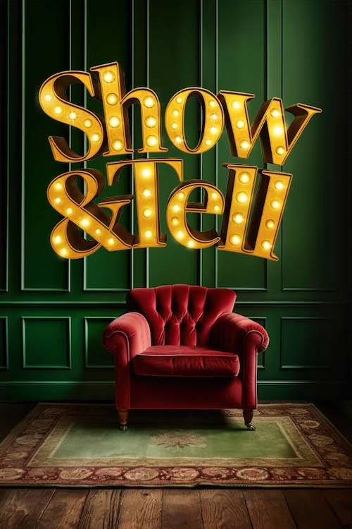
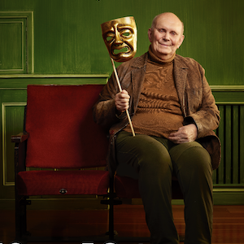
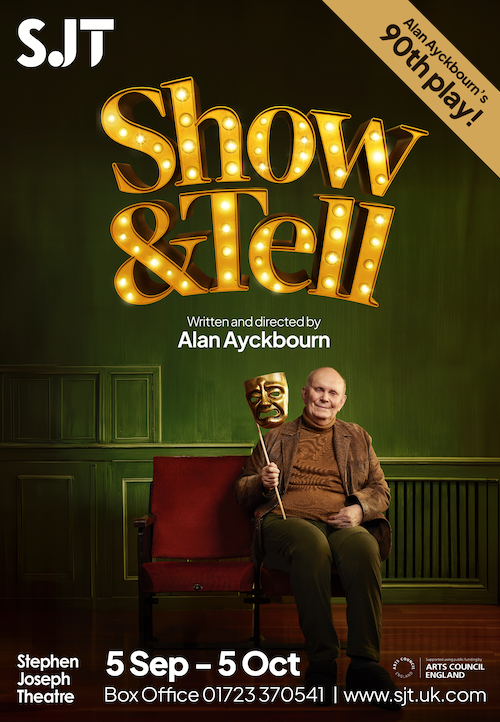

A collection of archive material, posters, rehearsal and production images pertaining to Alan Ayckbourn's *Show & Tell*. The Archive Images page is presented in association with the **[Borthwick Institute for Archives](/)** at the University of York where the Ayckbourn Archive is held. Click on an image to expand.

### Show & Tell (2024)

Alan Ayckbourn's early notes for the staging of *Show & Tell*.

**Copyright:** Haydonning Ltd  
**Holding:** Borthwick Institute for Archives

*Do not reproduce images without permission of the copyright holder.*

Designer Kevin Jenkins' CGI design for act 1 of *Show & Tell*.

**Copyright:** Kevin Jenkins  
**Holding:** The Bob Watson Archive

*Do not reproduce images without permission of the copyright holder.*

Designer Kevin Jenkins' ground plan for act II of *Show & Tell*.

**Copyright:** Kevin Jenkins  
**Holding:** The Bob Watson Archive

*Do not reproduce images without permission of the copyright holder.*

Unusually there were two posters produced for *Show & Tell*. An initial placeholder, pictured here…

**Copyright:** Scarborough Theatre Trust  
**Holding:** The Bob Watson Archive

*Do not reproduce images without permission of the copyright holder.*

And a second poster with the playwright himself, produced once he was available for a portrait for the final and more widely distributed design.

**Copyright:** Scarborough Theatre Trust  
**Holding:** The Bob Watson Archive

*Do not reproduce images without permission of the copyright holder.*  
*The Archive Images pages are presented in association with the* ***[Borthwick Institute for Archives](/)*** *at the University of York, where the Ayckbourn Archive is held.*

*All images on this page are copyright of the respective and labelled individual / organisation and should not be reproduced without permission.*  
