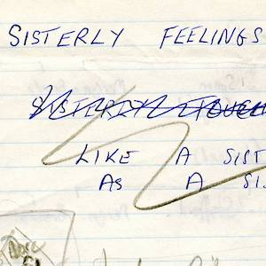
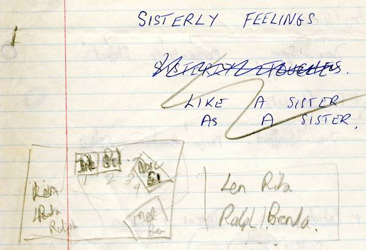
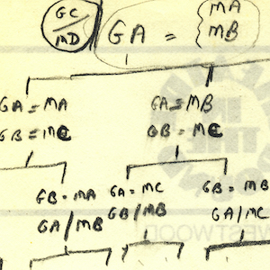
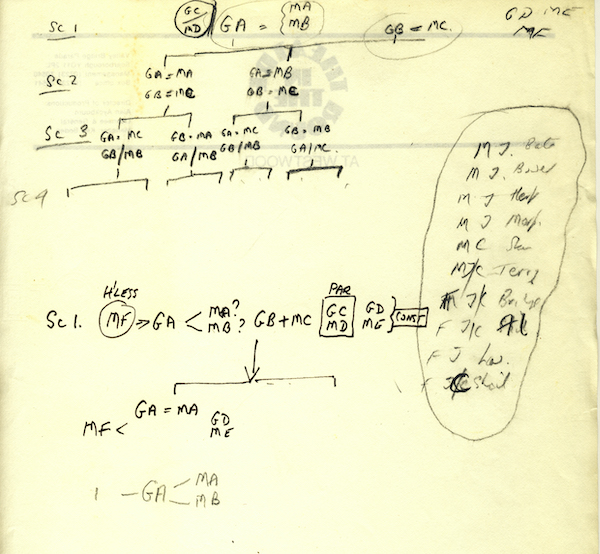
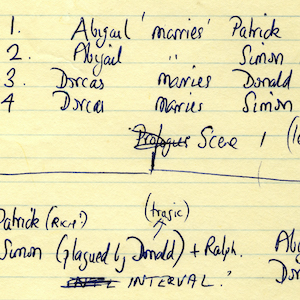
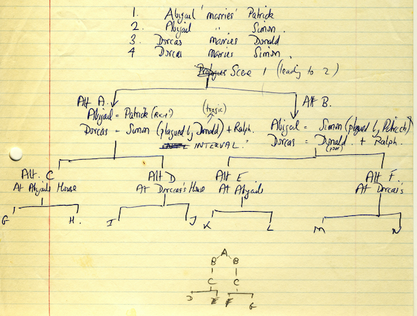
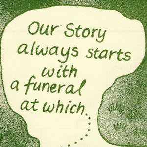
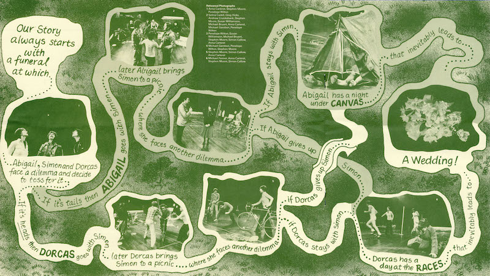

A collection of archive material, posters, rehearsal and production images pertaining to Alan Ayckbourn's *Sisterly Feelings*. The Archive Images page is presented in association with the **[Borthwick Institute for Archives](/)** at the University of York where the Ayckbourn Archive is held. Click on an image to expand.

### Sisterly Feelings (1979)

The Ayckbourn Archive at the Borthwick Institute for Archives at the University of York holds a selection of handwritten notes by Alan Ayckbourn for *Sisterly Feelings*. This page includes alternative titles for the play as well as a thumbnail sketch of the proposed set.

*Do not reproduce images without permission of the copyright holder.*

The branching nature of *Sisterly Feelings* was always embedded in the play since its conception by the author. However, it was initially a more complex structure - whose form the author would eventually use in *Intimate Exchanges*. This is an sketch of the abandoned *Sisterly Feelings* structure.

*Do not reproduce images without permission of the copyright holder.*

This continues the initial more complex structure of *Sisterly Feelings* but with now recognisable character names in place. This is the last reference to the branching structure later used for *Intimate Exchanges* in archive before Alan reverted to a less complex random structure for *Sisterly Feelings*.

*Do not reproduce images without permission of the copyright holder.*

The programme for the National Theatre's production of *Sisterly Feelings* included a diagram illustrating the structure of the play and how its two random choices affected the narrative.

**Copyright:** National Theatre  
**Holding:** Borthwick Institute for Archives

*Do not reproduce images without permission of the copyright holder.*    *The Archive Images pages are presented in association with the* ***[Borthwick Institute for Archives](/)*** *at the University of York, where the Ayckbourn Archive is held.*

*All images on this page are copyright of the respective and labelled individual / organisation and should not be reproduced without permission.*  
