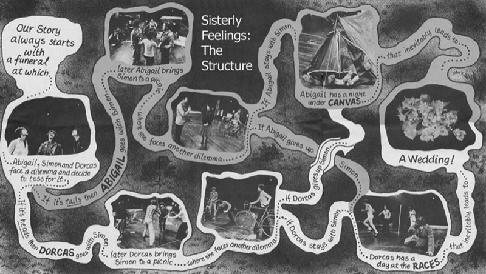

*Sisterly Feelings* is the first of Alan Ayckbourn's 'chance' plays in which at two points, an option is offered which leads a choice of alternate scenes. These choices take pace at the end of act I, scene I (the choice is made by a coin-toss) and at the end of act I, scene II (a decision made by whichever actress won the coin toss). This gives four possible permutations of the play. The first and last scene are the same regardless of choices made within the play.  
The illustration below of the structure of *Sisterly Feelings* was produced by the National Theatre for its 1980 production of the play. It remains one of the most concise and best illustrations of the structure of the play.

*Image copyright: National Theatre.*
