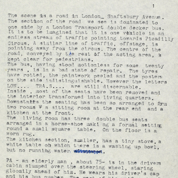
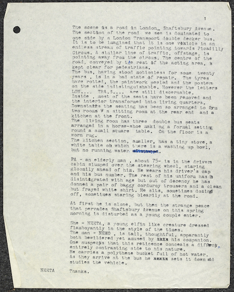
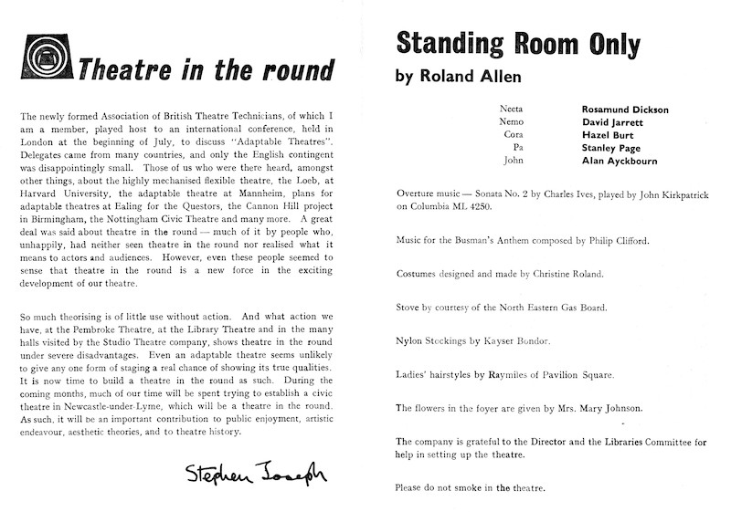
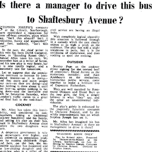
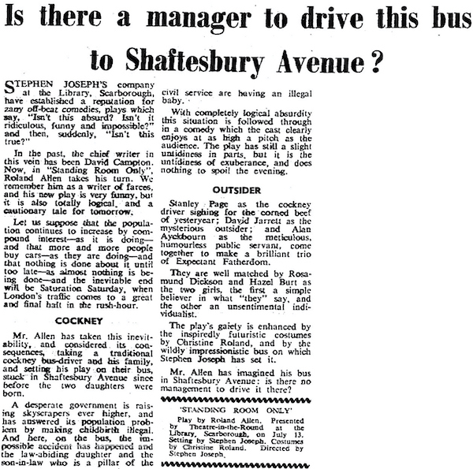
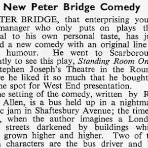
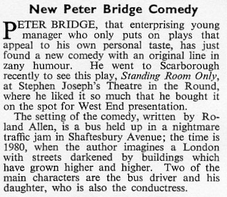

A collection of archive material, posters, rehearsal and production images pertaining to Alan Ayckbourn's *Standing Room Only*. The Archive Images page is presented in association with the **[Borthwick Institute for Archives](/)** at the University of York where the Ayckbourn Archive is held. Click on an image to expand.

### Standing Room Only (1961)

The first page of the original manuscript - before its many revisions - of *Standing Room Only* held in the Ayckbourn Archive in the Borthwick Institute for Archives at the University of York.

**Copyright:** Haydonning Ltd  
**Holding:** Borthwick Institute For Archives

*Do not reproduce images without permission of the copyright holder.*

The interior of the programme for the world premiere production of *Standing Room Only* at Theatre in the Round at the Library Theatre, Scarborough, in 1961.

**Copyright:** Scarborough Theatre Trust  
**Holding:** The Bob Watson Archive

*Do not reproduce images without permission of the copyright holder.*

The infamous review of *Standing Room Only* from The Stage newspaper on 20 July 1961, written by the production's stage manager and imploring it to be picked up for the West End.

**Copyright:** The Stage Media Company Ltd  
**Holding:** Borthwick Institute For Archives

*Do not reproduce images without permission of the copyright holder.*

Plays & Players magazine's report in its September 1961 edition that the producer Peter Bridge had optioned *Standing Room Only* for the West End; it was never actually produced.

**Copyright:** Plays & Players  
**Holding:** Borthwick Institute For Archives

*Do not reproduce images without permission of the copyright holder.*  
*The Scene, Archive Images and Research pages are presented in association with the* ***[Borthwick Institute for Archives](/)*** *at the University of York, where the Ayckbourn Archive is held.*

*All images on this page are copyright of the respective and labelled individual / organisation and should not be reproduced without permission.*  
