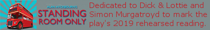

**Availability**

***Standing Room Only* Quote**  
"Let’s get this straight. Am I to understand that you went round and round the Government Multiple Store with your polythene basket till you saw somebody you liked the look of and then asked him to marry you. Am I right?"  
**Standing Room Only**

*The Standing Room Only section of this website is dedicated to*  
*Dick & Lottie theatre company & Simon Murgatroyd.*
