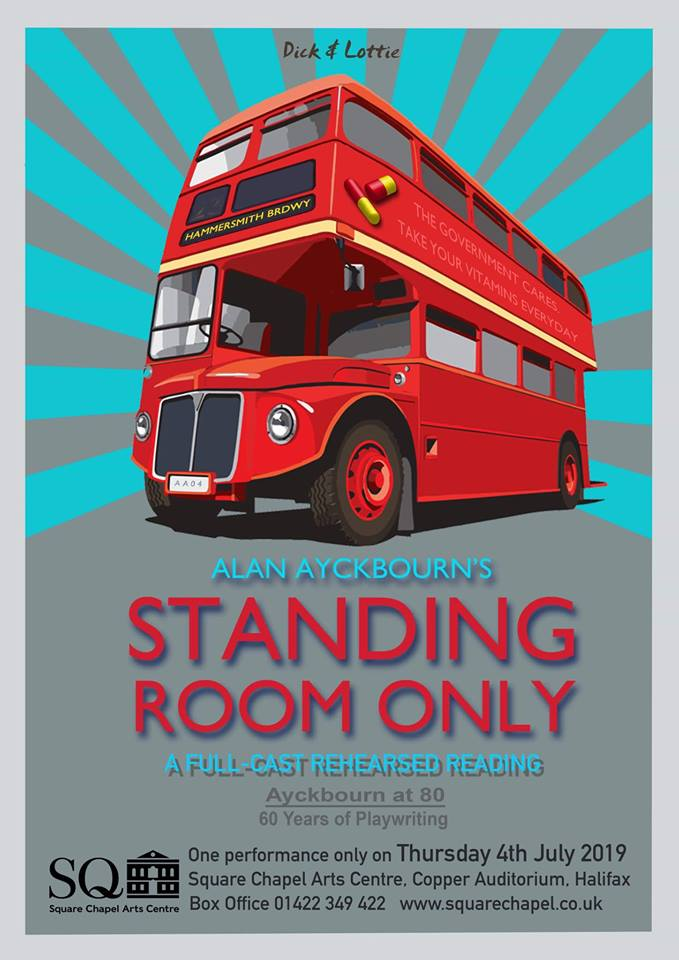
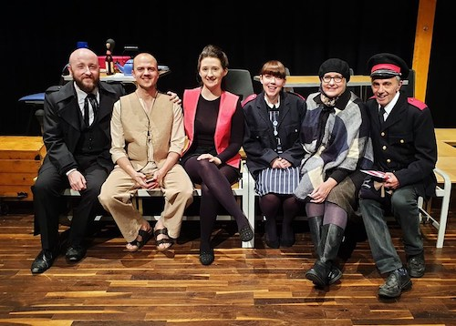
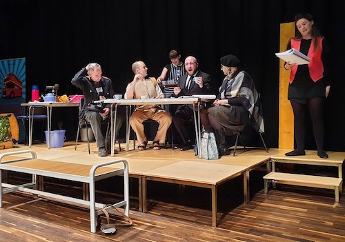

In 2019, Alan Ayckbourn celebrated both his 80th birthday and his 60th anniversary as a playwright. To mark the occasion, the playwright gave Dick & Lottie theatre company exclusive permission to present his play *Standing Room Only* for one night only.

### The Event

The evening featured the first public performance of *Standing Room Only* since 1966 with a professional full-cast rehearsed reading. It was presented by Dick & Lottie theatre company at The Square Chapel Theatre, Halifax, on Thursday 4 July. The performance was directed by Dick & Lottie's Artistic Director John Cotgrave with music by Paul Chamberlain and design by Richard McArtney. An introduction to the play was given by Alan Ayckbourn's Archivist, Simon Murgatroyd (the introduction can be read [here](/plays/standing-room-only/articles/standing-room-only-talk)).  
This performance took place with special permission from the playwright himself and was an exclusive and unique opportunity to see this early Ayckbourn play performed as the playwright does not intend for it to be presented again.

### The Play

*Standing Room Only* is Alan Ayckbourn's fourth play, premiered at the Library Theatre, Scarborough, in 1961. Withdrawn since 1966, it is notable for a number of reasons not least it being the first play attributed to Alan Ayckbourn rather than his early writing pseudonym. It was the first of his own plays he directed himself, the first of his plays to be optioned for both the West End and television and, arguably, the first of his plays where the playwright's own voice is beginning to emerge. It has never been performed since 1966 and there is no intent by the playwright to either publish it or make it available to produce in the future.  
The play exists in several different versions and the script used for this performance is the version which was performed in 1963 at the Victoria Theatre, Stoke-on-Trent and considered the definitive text.

### Dick & Lottie

Dick & Lottie is a professional theatre company dedicated to performing the works of Alan Ayckbourn, which celebrated its 15th anniversary during 2019.

### The Company

**Character** **Actor**  
**Pa** Leslie Davidoff  
**Cora** Leah Grey-Scaife  
**Nita** Hannah Sims  
**Ellie** Maria Sykes  
**Paul** Darren Jeffries  
**John** Joe Geddes  
**Director** John Cotgrave  
**Design** Richard McArtney  
**Music** Paul Chamberlain  
**Advisor** Simon Murgatroyd

*All research for this page by Simon Murgatroyd. Poster and images copyright of Richard McArtney. Please do note reproduce without permission of the copyright holder.*

