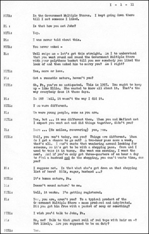

*This page reproduces a scene from the play offering an insight into and a taste of the unpublished work. The dialogue is reproduced in the style of the original including grammatical choices / errors.*

**Act 1, Scene 1** (pages 10 - 11)  
*(A double-decker bus).*  
**Pa:** Who’s she going to meet then?  
**Nita:** It’s not who she’s going to meet. It’s who she’s trying to meet.  
**Pa:** Like who?  
**Nita:** Like some man.  
**Pa:** What for?  
**Nita:** Oh Pa. What do you think for. How do you think I got engaged to be registered?  
**Pa:** Do you mean…?  
**Nita:** That’s what she’s hoping to do. That’s how I did it.  
**Pa:** How?  
**Nita:** In the Government Multiple Stores. I kept going down there until I met someone I liked.  
**Pa:** Is that how you met John?  
**Nita:** Yep.  
**Pa:** I was never told about this.  
**Nita:** You never asked -  
**Pa:** Well, swipe me - let’s get this straight. Am I to understand that you went round and round the Government Multiple Store with your polythene basket till you saw somebody you liked the look of and then asked him to marry you. Am I right?  
**Nita:** Yes, more or less.  
**Pa:** Got a romantic nature, haven’t you?  
**Nita:** Oh, Pa. You’re so antiquated. This is 1997. You ought to keep up - like Ellie. She wanted to know all about it. That’s the way everybody does it these days.  
**Pa:** Is it? Well, it wasn’t the way I did it.  
**Nita:** You were different.  
**Pa:** We were young people, same as you are.  
**Nita:** Yes, but… it was different then. When you and Ma first met I expect you went out and did things together, didn’t you?  
**Pa:** Yes… *(He smiles, recovering)* yes, yes.  
**Nita:** Well, you can’t today, can you? Things are different. When do I get a chance to go out? A two-hour pass once a week, that’s all. I can’t waste that wandering around looking for someone, so it’s got to be with a shopping pass. Cora and I used to take it in turns. She went one morning, I went the next. And if you’ve only got three-quarters of an hour a day to find a husband and do the shopping, you can’t waste time, can you?  
**Pa:** I suppose not. Is that what she’s got down on that shopping list of hers? Milk, sugar, husband…?  
**Nita:** It’s human nature, Pa.  
**Pa:** Doesn’t sound human nature to me.  
**Nita:** Well, it works. I’m getting registered.  
**Pa:** Yes, you are, aren’t you? To a typical product of the Government Multiple Store - mass produced and dehydrated. Did you get him free with a packet of soup or something?  
**Nita:** I wish you’d talk to John, Pa.  
**Pa:** Ha, me? Talk to that great roll of red tape with hair on - ? Not likely.
