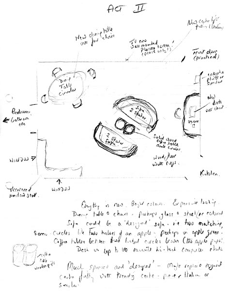
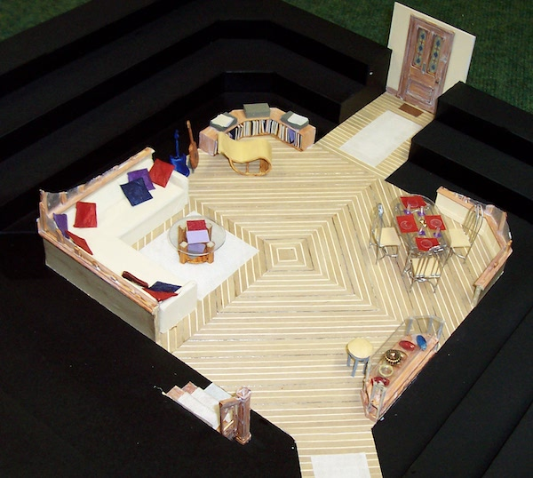
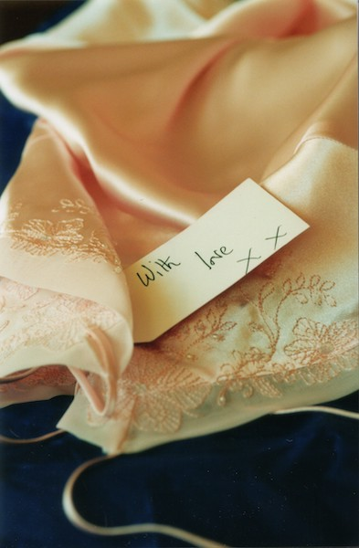
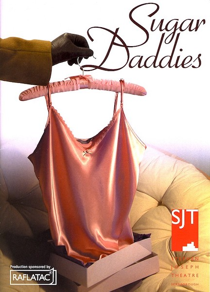
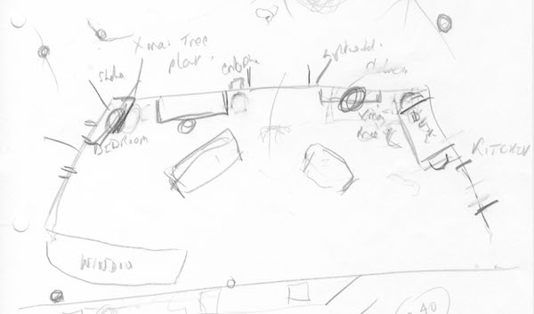
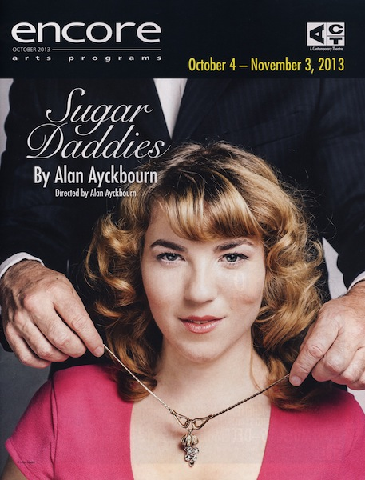

A collection of archive material, posters, rehearsal and production images pertaining to Alan Ayckbourn's *Sugar Daddies*. The Archive Images page is presented in association with the **[Borthwick Institute for Archives](/)** at the University of York where the Ayckbourn Archive is held. Click on an image to expand.

### Sugar Daddies (2003)

Alan Ayckbourn's initial set design sketch for Act II of *Sugar Daddies* for its in-the-round world premiere at the Stephen Joseph Theatre, Scarborough, in 2003.

**Copyright:** Haydonning Ltd  
**Holding:** Borthwick Institute for Archives

*Do not reproduce images without permission of the copyright holder.*

The model box for Act II of the world premiere of *Sugar Daddies* in 2003, designed by Michael Holt.

**Copyright:** Michael Holt  
**Holding:** The Bob Watson Archive

*Do not reproduce images without permission of the copyright holder.*

An early concept design for the poster for the world premiere of *Sugar Daddies* in 2003.

**Copyright:** Scarborough Theatre Trust  
**Holding:** The Bob Watson Archive

*Do not reproduce images without permission of the copyright holder.*

The poster for the world premiere of *Sugar Daddies* at the Stephen Joseph Theatre, Scarborough, in 2003.

**Copyright:** Scarborough Theatre Trust  
**Holding:** Borthwick Institute for Archives

*Do not reproduce images without permission of the copyright holder.*

Alan Ayckbourn's sketch for the 2004 set design for the end-stage tour of *Sugar Daddies*.

**Copyright:** Haydonning Ltd  
**Holding:** Borthwick Institute for Archives

*Do not reproduce images without permission of the copyright holder.*

The programme cover for Alan Ayckbourn's 2013 revival of *Sugar Daddies* at the ACT, Seattle.

**Copyright:** ACT Theatre, Seattle  
**Holding:** Borthwick Institute for Archives

*Do not reproduce images without permission of the copyright holder.*  
*The Archive Images pages are presented in association with the* ***[Borthwick Institute for Archives](/)*** *at the University of York, where the Ayckbourn Archive is held.*

*All images on this page are copyright of the respective and labelled individual / organisation and should not be reproduced without permission.*  
