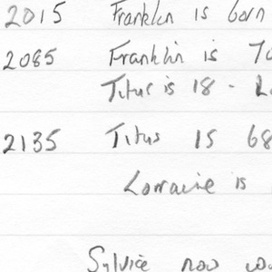
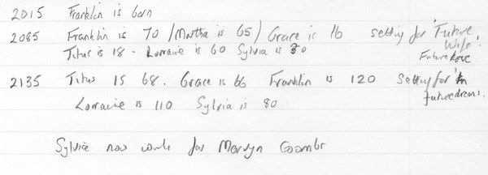
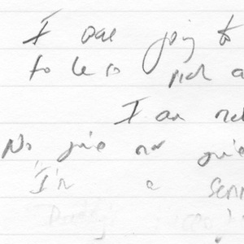
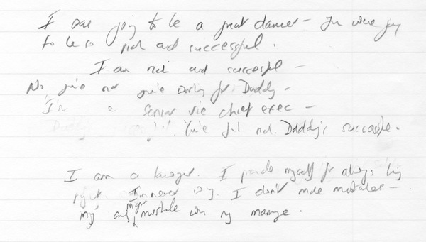
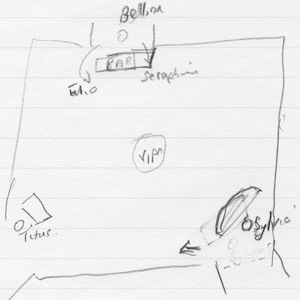
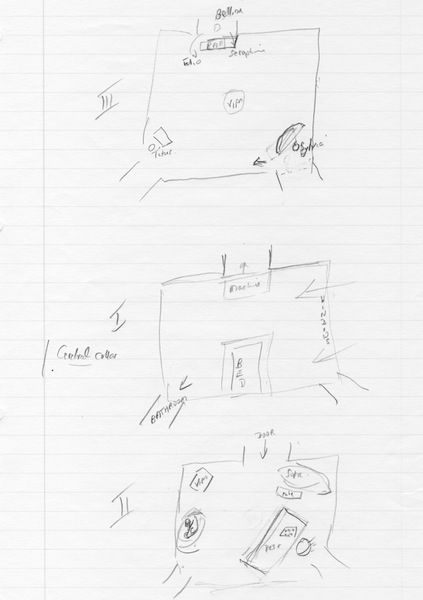
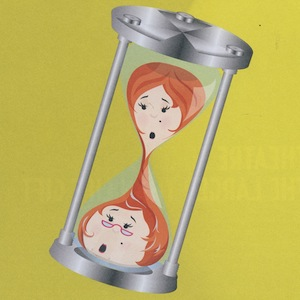
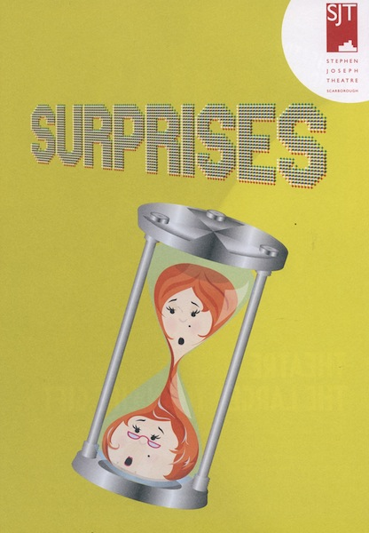

A collection of archive material, posters, rehearsal and production images pertaining to Alan Ayckbourn's *Surprises*. The Archive Images page is presented in association with the **[Borthwick Institute for Archives](/)** at the University of York where the Ayckbourn Archive is held. Click on an image to expand.

### Surprises (2012)

Early hand-written notes for *Surprises* by Alan Ayckbourn establishing the setting of the play and the ages of the characters.

*Do not reproduce images without permission of the copyright holder.*

More early handwritten notes by Alan Ayckbourn for *Surprises* with early dialogue thoughts for the character of Grace.

*Do not reproduce images without permission of the copyright holder.*

Alan Ayckbourn's sketches for the sets for the three acts of *Surprises* for the world premiere production at the Stephen Joseph Theatre, Scarborough, in 2012.

*Do not reproduce images without permission of the copyright holder.*

The original production of *Surprises* in 2012 had three different posters for its world premiere at Scarborough, its transfer to Chichester Festival Theatre and then its UK tour. This is the original poster for the Stephen Joseph Theatre, which was replaced for Chichester.

**Copyright:** Scarborough Theatre Trust  
**Holding:** Borthwick Institute for Archives

*Do not reproduce images without permission of the copyright holder.*    *The Scene and Archive Images pages are presented in association with the* ***[Borthwick Institute for Archives](/)*** *at the University of York, where the Ayckbourn Archive is held.*

*All images on this page are copyright of the respective and labelled individual / organisation and should not be reproduced without permission.*  
