A collection of archive material, posters, rehearsal and production images pertaining to Alan Ayckbourn's *Taking Steps*. The Archive Images page is presented in association with the **[Borthwick Institute for Archives](/)** at the University of York where the Ayckbourn Archive is held. Click on an image to expand.

### Taking Steps (1979)

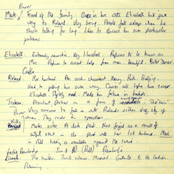

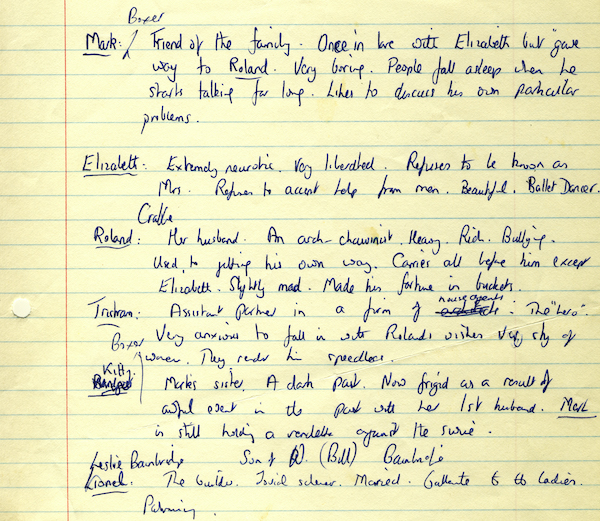

Within the Ayckbourn Archive at the Borthwick Institute for Archives, there are Alan Ayckbourn's hand-written notes for *Taking Steps* including these early insights into the characters in the play.

*Do not reproduce images without permission of the copyright holder.*

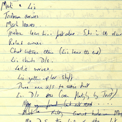

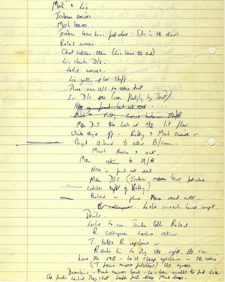

Within the Ayckbourn Archive at the Borthwick Institute for Archives, there are Alan Ayckbourn's hand-written notes for *Taking Steps* including this early plot-breakdown of the play.

*Do not reproduce images without permission of the copyright holder.*

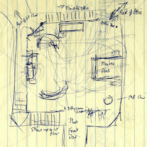

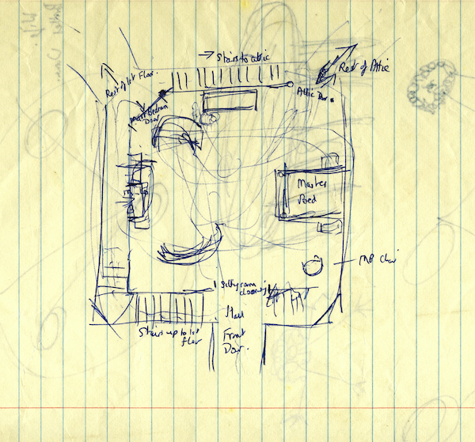

*Taking Steps* is regarded by Alan Ayckbourn as his only farce and is renowned for its unusual staging which really only works in-the-round with three floors transposed upon one another. This is an early sketch by the playwright of the stage-space held in the Borthwick Institute for Archives.

*Do not reproduce images without permission of the copyright holder.*

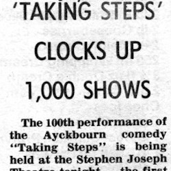

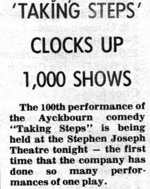

A newspaper cutting from the Scarborough Evening News on 4 September 1980 with a rather notable - and obvious - error. *Taking Steps* was the first play staged at the Stephen Joseph Theatre in the Round to reach 100 performances (only one other play has subsequently achieved this) rather than the 1,000 shows noted by this headline!

**Copyright: The** Scarborough News  
**Archive:** Borthwick Institute For Archives

*Do not reproduce images without permission of the copyright holder.*

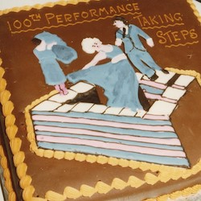

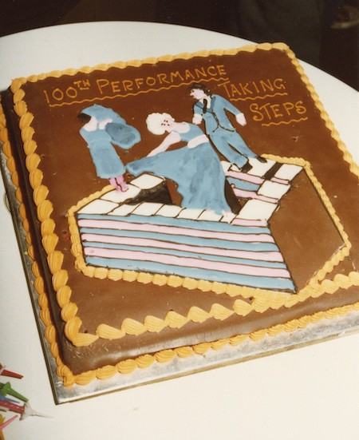

To mark *Taking Steps* becoming the first play staged by the Scarborough company to reach 100 performances, a special cake was made based upon the poster for the production at the Stephen Joseph Theatre in the Round.

*Do not reproduce images without permission of the copyright holder.*

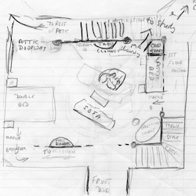

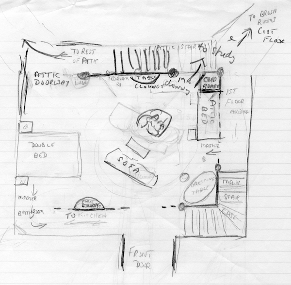

During 1990, Alan Ayckbourn revived *Taking Steps* at the Stephen Joseph Theatre in the Round with Michael Gambon playing Roland Crabbe. This is the playwright's sketch of the set for the revival.

*Do not reproduce images without permission of the copyright holder.*

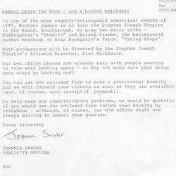

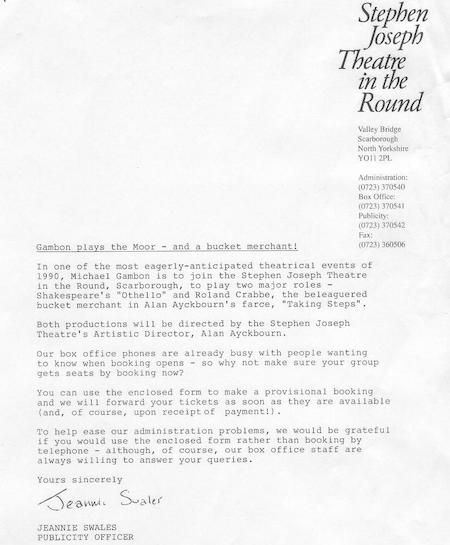

A press release for Alan Ayckbourn's 1990 revival of *Taking Steps* at the Stephen Joseph Theatre in the Round promoting the fact Michael Gambon was to appear in both this play and *Othello* - marking the first (and last) time Alan Ayckbourn directed a play by Shakespeare.

**Copyright:** Scarborough Theatre Trust  
**Archive:** The Bob Watson Archive

*Do not reproduce images without permission of the copyright holder.*

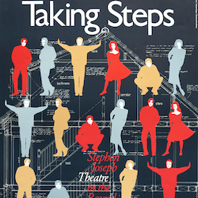

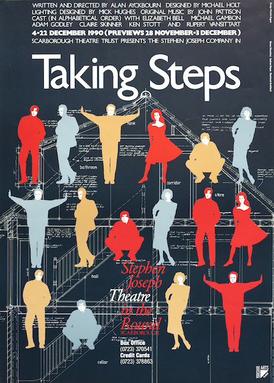

The poster for Alan Ayckbourn's 1990 revival of *Taking Steps* at the Stephen Joseph Theatre in the Round. Like many of Alan Ayckbourn's plays, it is not particularly easy to find a defining image for a poster and this design is one of the more unusual ones for the play.

**Copyright:** Scarborough Theatre Trust  
**Archive:** The Bob Watson Archive

*Do not reproduce images without permission of the copyright holder.*

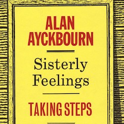

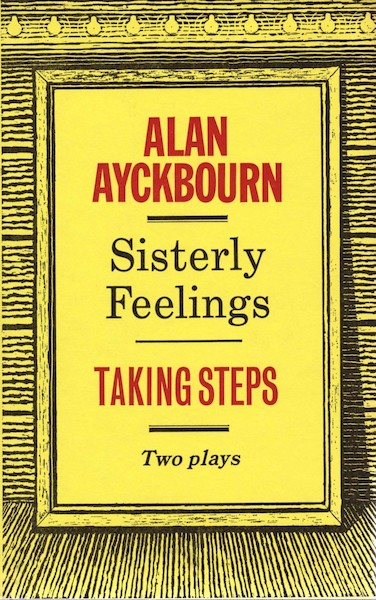

In 1981, *Taking Steps* was published in a mass-market hardback edition alongside *Sisterly Feelings*. This is the cover to the rare edition which is one of three hardback collection alongside *The Norman Conquests* and *Three Plays*.

**Copyright:** Chatto & Windus  
**Archive:** Borthwick Institute for Archives

*Do not reproduce images without permission of the copyright holder.*

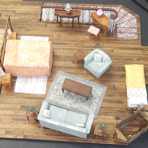

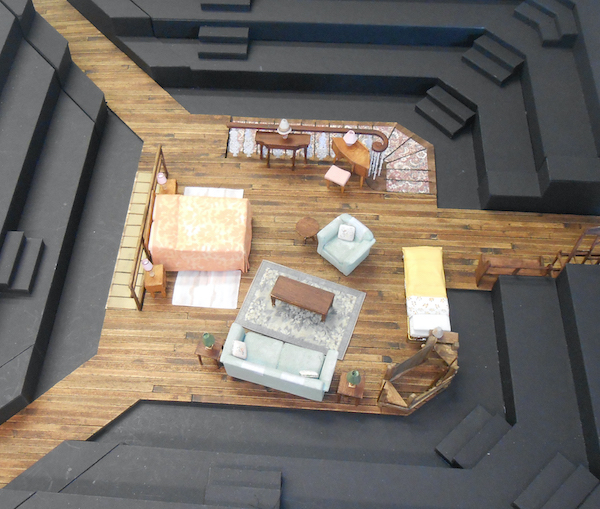

During 2017, Alan Ayckbourn revived *Taking Steps* at the Stephen Joseph Theatre, Scarborough. The production was designed by Kevin Jenkins whose set can be seen in this photograph of the model box. Note the two staircases for the three overlaid floors of the house.

**Copyright:** Kevin Jenkins  
**Archive:** Ayckbourn Digital Archive

*Do not reproduce images without permission of the copyright holder.*

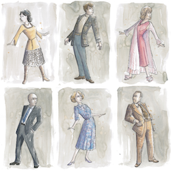

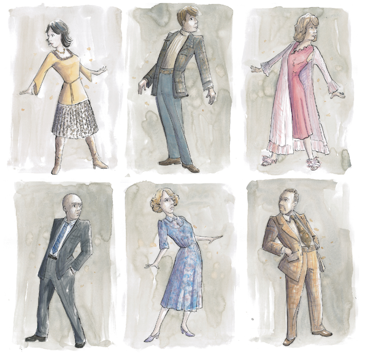

Another example of the designer Kevin Jenkins' work on Alan Ayckbourn's 2017 revival of *Taking Steps* at the Stephen Joseph Theatre. These are some of the costume designs created by Kevin for the revival.

**Copyright:** Kevin Jenkins  
**Archive:** The Bob Watson Archive

*Do not reproduce images without permission of the copyright holder.*     *The Archive Images pages are presented in association with the* ***[Borthwick Institute for Archives](/)*** *at the University of York, where the Ayckbourn Archive is held.*

*All images on this page are copyright of the respective and labelled individual / organisation and should not be reproduced without permission.*  
