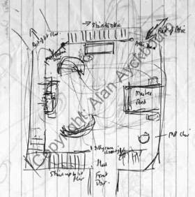
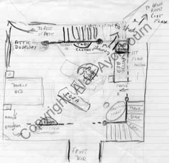
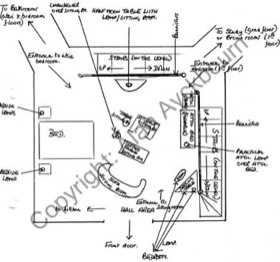
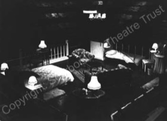
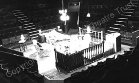

*"Three floors, then, linked by two flights of stairs; but to simplify - or perhaps to complicate - matters, all floors are at the same level."*  
*Author’s note to Taking Steps*

Ever since he began writing in 1959, the vast majority of Alan Ayckbourn’s plays have been premiered in-the-round. Most of them are conceived with this performance space in mind and undoubtedly work best in it. Of course they also generally adapt to other spaces and the majority of theatre-goers have probably only seen Ayckbourn plays in an end-stage / proscenium space.

There are though several Ayckbourn plays that are not so easy to transfer to the end-stage and were never intended to comfortably move away from the round. Plays such as *A Small Family Business* and *Things We Do For Love* were intended purely for end-stage performance and could not feasibly be staged in the round, so there are also Ayckbourn plays whose effectiveness is confined to the round.

Foremost amongst these plays is *Taking Steps*, a farce which works on the principle that the three storeys of The Pines house are overlaid on top of each other. Action on multiple levels of the house thus takes place simultaneously within the same space.

This juxtaposition, a development of an idea first used by the playwright in *How The Other Half Loves*, is a source of much humour. For example: At the climax of Act 2, Elizabeth is on the ‘first floor’ limbering up. On the ‘ground floor’, Roland, Tristram and Bainbridge are in discussion, distracted by the noise from above. Elizabeth jetés between the men, landing heavily causing plaster from the ceiling to fall from above onto the men.

The floor gags replace the door gags which are typical of most farces and, as a result, the floor is vital to the play. For it to work effectively, the audience has to see and comprehend the conceit of the overlaid floors. Unfortunately for most people approaching *Taking Steps*, there is no clear illustration of how this effect was achieved or even how it worked in the round. The Samuel French edition has a layout for the proscenium arch, but this is a highly unsatisfactory design and gives little indication of the author’s original intent.

*“I think it’s a play which works especially well in the round as the logic of the rooms sitting on top of each other as it were is more apparent.”*  
*Alan Ayckbourn*

Figure (1) is Alan’s original sketch for the world premiere of *Taking Steps* in 1979. Vague as it is, the flat steps and certain features of the house are made clear. Alongside it are other designs and photographs of the stage in which it becomes easier to understand how the floors are overlaid.

Sketches (2) and (3), created for Alan's 1990 revival are somewhat clearer and emphasise how the floor has become the backcloth for the play; that to fully appreciate the juxtaposition of situation and characters in the play, the audience has to be aware of the layout of the stage. In the end-stage, except perhaps for those in the Gods or upper circle, this is never going to be obvious as most of the audience are unable to see the entire floor of the stage; so the central device of the play - a farce with floors not doors - falls flat. An obvious example of this, as seen in the original London production, is the use of stairs. In the round, it is obvious by the stair rods and banisters, the characters are traversing stairways (the photos (4) and (5) show the stair rods and banisters). In the London production, the characters pretended to jog on the spot indicating their movement up and down the stairs; a very unsatisfactory solution.

Unfortunately, no images of the London staging are held in archive to illustrate these difficulties, although the Samuel French acting edition’s illustration offers an idea of how the play has be performed on an end-stage.

Generally speaking though, to stage it in the proscenium compromises the play to such an extent that much of the play becomes almost meaningless. The only solution Alan Ayckbourn has been able to offer to the end-stage dilemma is that utilised by the Stephen Joseph Theatre In The Round company during its tour of the play in 1980. The author explains:

*"The way we solved it was to put it all on a very step rake so the whole floor was visible to all the audience. This sloped platform was surrounded by an open skeletal framework with a few doorless doorways. Very un-naturalistic, but at least the audience got the joke.*  
*The only problem with the raked version is that the furniture needs to be screwed down, And the only problem with that is that the actors only have to walk into it once…."*  
*Alan Ayckbourn*

Sadly, no images or plans are held in archive of this production, but it did allow the audience to see the entire floor and appreciate the juxtaposition of different characters on different floors. Although obviously less than ideal - and hard work for the cast - it is the only solution to the end-stage problem that Alan thinks has ever worked and served the play well.

*"This enormous rake that we had was quite difficult. It was like walking up the south face of the Eiger. It was very steep, but nonetheless people got used to it. It allowed us to share the joke with the audience and have the stair rods and I have never seen it so satisfactorily \[in the end-stage\] without the rake.”*  
*Alan Ayckbourn*

*(1) Copyright: Alan Ayckbourn*

*(2) Copyright: Alan Ayckbourn*

*(3) Copyright: Alan Ayckbourn*

*(4) Copyright: Scarborough*  
*Theatre Trust*

*(5) Copyright: Scarborough*  
*Theatre Trust*
