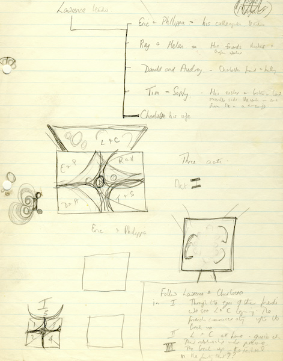
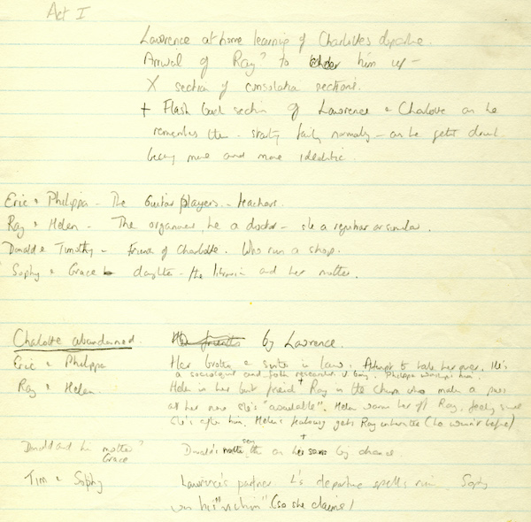
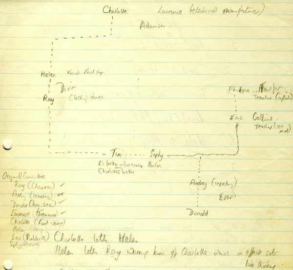
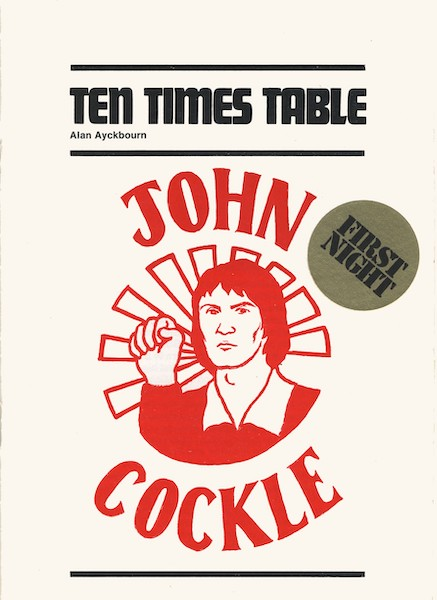
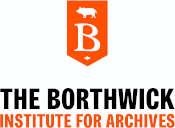

A collection of archive material, posters, rehearsal and production images pertaining to Alan Ayckbourn's *Ten Times Table*. The Archive Images page is presented in association with the **[Borthwick Institute for Archives](/)** at the University of York where the Ayckbourn Archive is held. Click on an image to expand.

### Ten Times Table (1977)

Alan Ayckbourn rewrote *Ten Times Table* after getting approximately half-way through the play. His early notes indicate the play was substantially different including - as can be seen here - a multi-location set in-the-round as opposed to the single location set of the actual play.

**Copyright:** Haydonning Ltd  
**Holding:** Borthwick Institute for Archives

*Do not reproduce images without permission of the copyright holder.*

More early notes by Alan Ayckbourn for *Ten Times Table* for a substantially different plot. Note the major character of Charlotte, central to the play and due to be performed by the playwright's partner Heather Stoney; the character was completely cut when the playwright began re-writing!

**Copyright:** Haydonning Ltd  
**Holding:** Borthwick Institute for Archives

*Do not reproduce images without permission of the copyright holder.*

A structure for the earliest concept for *Ten Times Table* showing the relationship between the various characters. Again, not how central Charlotte is to the piece and the difference in certain character names and relationships from the actual play.

**Copyright:** Haydonning Ltd  
**Holding:** Borthwick Institute for Archives

*Do not reproduce images without permission of the copyright holder.*

The cover for the first night programme for the world premiere of *Ten Times Table* at the Stephen Joseph Theatre in the Round, Scarborough, in 1977.

**Copyright:** Scarborough Theatre Trust  
**Holding:** Borthwick Institute for Archives

*Do not reproduce images without permission of the copyright holder.*  
*The Archive Images pages are presented in association with the* ***[Borthwick Institute for Archives](/)*** *at the University of York, where the Ayckbourn Archive is held.*

*All images on this page are copyright of the respective and labelled individual / organisation and should not be reproduced without permission.*   
