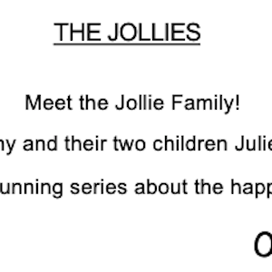
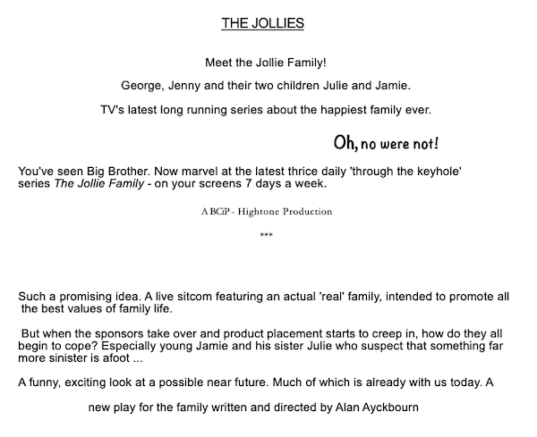
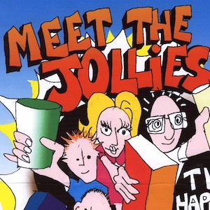
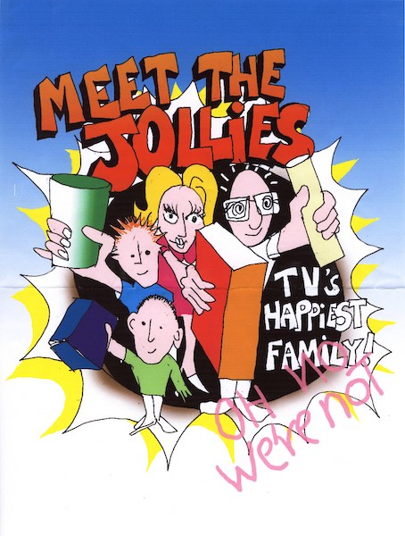
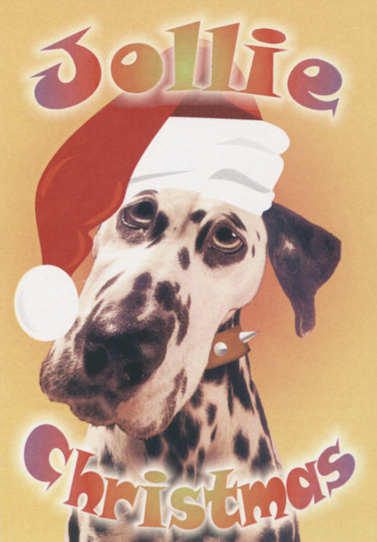

A collection of archive material, posters, rehearsal and production images pertaining to Alan Ayckbourn's *The Jollies*. The Archive Images page is presented in association with the **[Borthwick Institute for Archives](/)** at the University of York where the Ayckbourn Archive is held. Click on an image to expand.

### The Jollies (2002)

Alan Ayckbourn's original notes for the advertisment copy for his original unwritten version of The Jollies; a substantially different idea to that written.

*Do not reproduce images without permission of the copyright holder.*

Before Alan Ayckbourn wrote a completely different play, advertising concepts for *The Jollies* were created including this initial poster design. These were abandoned when Alan delivered a different play!

*Do not reproduce images without permission of the copyright holder.*

For Christmas 2002, the Stephen Joseph Theatre produced a limited number of Christmas postcards based on an amended *The Jollies* poster.

**Copyright:** Scarborough Theatre Trust  
**Holding:** Borthwick Institute for Archives

*Do not reproduce images without permission of the copyright holder.*     *The Archive Images pages are presented in association with the* ***[Borthwick Institute for Archives](/)*** *at the University of York, where the Ayckbourn Archive is held.*

*All images on this page are copyright of the respective and labelled individual / organisation and should not be reproduced without permission.*  
