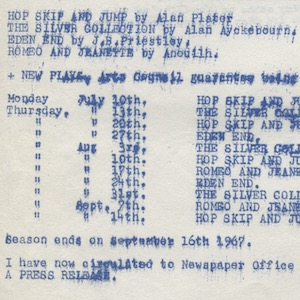
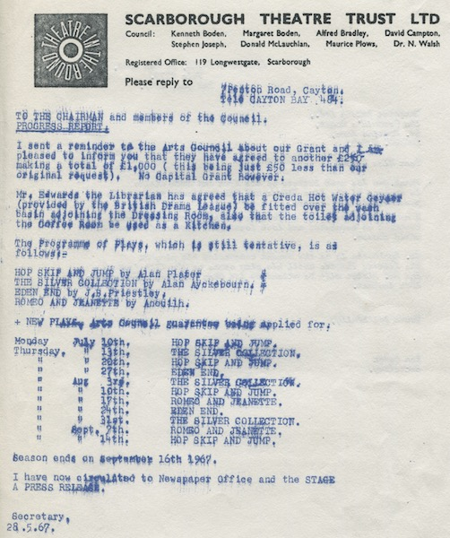
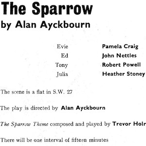
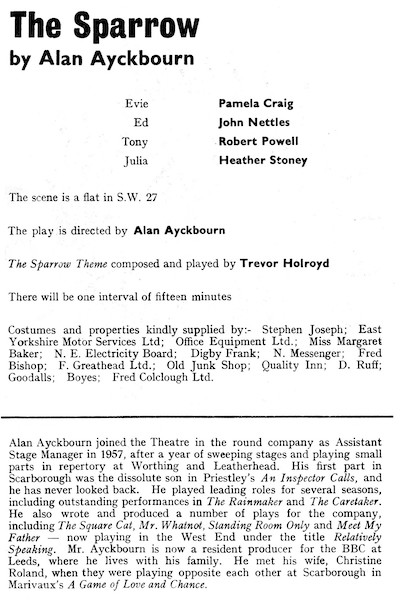
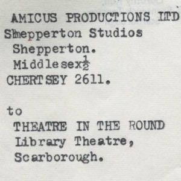
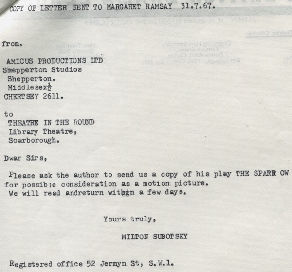
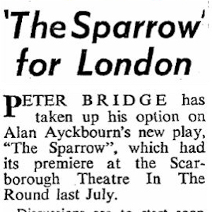
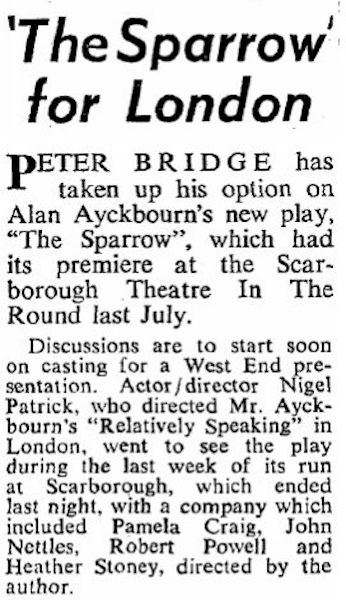

A collection of archive material, posters, rehearsal and production images pertaining to Alan Ayckbourn's *The Sparrow*. The Archive Images page is presented in association with the **[Borthwick Institute for Archives](/)** at the University of York where the Ayckbourn Archive is held. Click on an image to expand.

### The Sparrow (1967)

Although blurred, this is a report for the plan for the 1967 summer season at Theatre in the Round at the Library Theatre, Scarborough, in which *The Sparrow* is initially called *The Silver Collection*.

**Copyright:** Scarborough Theatre Trust  
**Holding:** The Bob Watson Archive

*Do not reproduce images without permission of the copyright holder.*

Interior from the programme for the world premiere of *The Sparrow* at Theatre in the Round at the Library Theatre in 1967. Note the cast which include John Nettles, Robert Powell and the playwright's future second wife, Heather Stoney.

**Copyright:** Scarborough Theatre Trust  
**Holding:** Borthwick Institute For Archives

*Do not reproduce images without permission of the copyright holder.*

A letter to Alan Ayckbourn from 1967 expressing interest in a film of *The Sparrow* by the British film-making company, Amicus. It is not whether a script was sent but the film went no further.

*Do not reproduce images without permission of the copyright holder.*

An article published in The Stage on 7 September 1967 about the producer Peter Bridge optioning *The Sparrow* for the West End. Despite this, the play was never produced in London - or anywhere else!

**Copyright:** The Stage Media Ltd  
**Holding:** Borthwick Institute For Archives

*Do not reproduce images without permission of the copyright holder.*    *The Scene, Archive Images and Research pages are presented in association with the* ***[Borthwick Institute for Archives](/)*** *at the University of York, where the Ayckbourn Archive is held.*

*All images on this page are copyright of the respective and labelled individual / organisation and should not be reproduced without permission.*  
