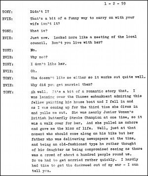

*This page reproduces a scene from the play offering an insight into and a taste of the work. The dialogue is reproduced in the style of the original including grammatical choices / errors.  
Dialogue in italics indicates material cut from the performed script.*

### Act I Scene II

**Evie:** She's got a nice car.  
**Tony:** Has she?  
**Evie:** Great. She must be rich.  
**Tony:** She's loaded.  
**Evie:** That a fact? Who is she then?  
**Tony:** She's my wife.  
**Evie:** Oh.  
**Tony:** Yes. Didn't we mention it?  
**Evie:** Not that I remember.... You didn't even tell me you were married.  
**Tony:** Didn't I?  
**Evie:** That's a bit of a funny way to carry on with your wife isn't it?  
**Tony:** What ---?  
**Evie:** Just now. Looked more like a meeting of the local council. Don't you live with her?  
**Tony:** No.  
**Evie:** Why not?  
**Tony:** I don't like her.  
**Evie:** Oh.  
**Tony:** She doesn't like me either so it works out quite well.  
**Evie:** Why did you get married then?  
**Tony:** Ah well. It’s a bit of a romantic story that. I was over the Thames embankment admiring this fellow painting his house boat and I fell in and as I was coming up for the third time she dives in and pulls me out. She was nearly Junior Women's British Butterfly Stroke Champion at one time, so it was a walk over for her. And she pulled me ashore and gave me the kiss of life. Well, just at that moment who should come along on his bike but her father who was delivering newspapers at the time, and being an old-fashioned type he rather thought of his daughter as being compromised seeing as there was a crowd of about a hundred people round us. So we had to get married rather quickly. I hardly had time to get the duckweed out of my ear - I can tell you.  
**Evie:** *(disbelieving)* That's not why.  
**Tony:** Something like that. It was a long time ago now, you can't expect me to remember all the details.  
**Evie:** You know something? I think you're ever so slightly a bit of a stark raving nut-head.  
**Tony:** What gives you that impression?  
**Evie:** I've been thinking it out.
