A collection of archive material, posters, rehearsal and production images pertaining to Alan Ayckbourn's *The Square Cat*. The Archive Images page is presented in association with the **[Borthwick Institute for Archives](/)** at the University of York where the Ayckbourn Archive is held. Click on an image to expand.

### The Square Cat (1955)

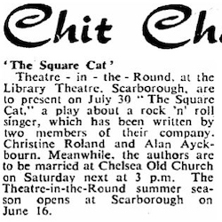

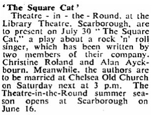

The earliest known press cutting regarding *The Square Cat* was published in The Stage newspaper on 7 May 1959. It mentions both the play and Alan's marriage to Christine Roland the following week. Notably the play is attributed to Alan rather than the pseudonym he would actually use for the play.

**Copyright:** The Stage Media Company Ltd  
**Holding:** Borthwick Institute For Archives

*Do not reproduce images without permission of the copyright holder.*

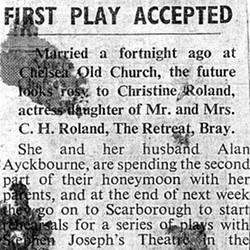

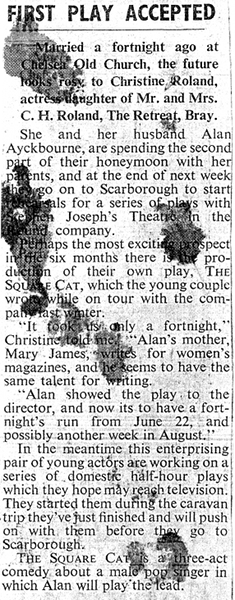

A newspaper cutting circa May 1959 reporting on the marriage between Alan Ayckbourn and Christine Roland. The provenance is unknown but is local to Christine's parents. The piece makes mention of not only *The Square Cat* but unsuccessful pitches for television scripts.

**Copyright:** To be confirmed  
**Holding:** Borthwick Institute For Archives

*Do not reproduce images without permission of the copyright holder.*

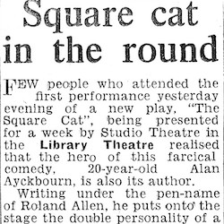

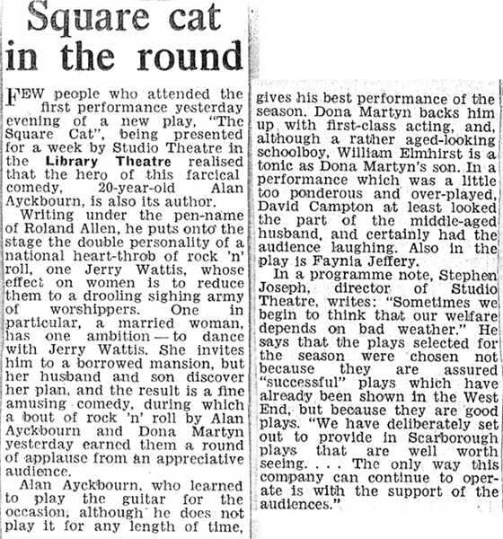

This is the first ever review of an Alan Ayckbourn play and was carried in Scarborough's local newspaper, the Scarborough Evening News on 31 July 1959. Alan starred in *The Square Cat* as Theatre in the Round at the Library Theatre's Artistic Director, Stephen Joseph, had challenged him to write a play - but with the proviso he took the lead role; for several years Alan saw playwriting merely as a means of propelling forward his own acting career.

**Copyright:** The Scarborough News  
**Holding:** Borthwick Institute For Archives

*Do not reproduce images without permission of the copyright holder.*

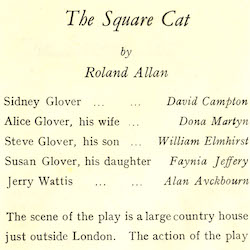

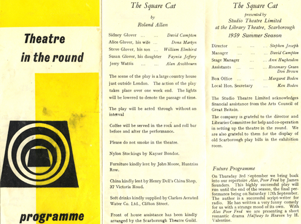

The programme for *The Square Cat*. It is notable Alan's writing pseudonym is mis-spelt Roland Allan rather than Roland Allen (the name derives from the fact the play was a joint effort between Alan and his wife Christine Roland). Also Alan played a dual role of Jerry Wattis and Arthur Brummage in the play but no mention is made of the latter character.

**Copyright:** Scarborough Theatre Trust  
**Holding:** Borthwick Institute For Archives

*Do not reproduce images without permission of the copyright holder.*

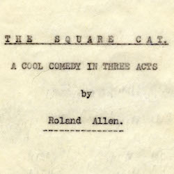

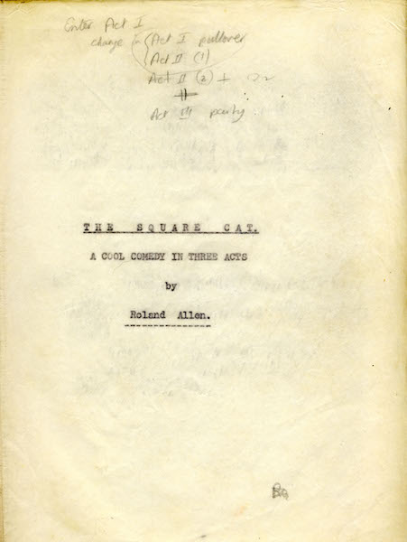

The Borthwick Institute for Archives holds an original manuscript for Alan Ayckbourn's first play, *The Square Cat*. This is the cover page complete with notes by the author.

*Do not reproduce images without permission of the copyright holder.*

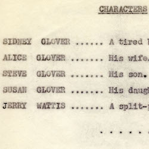

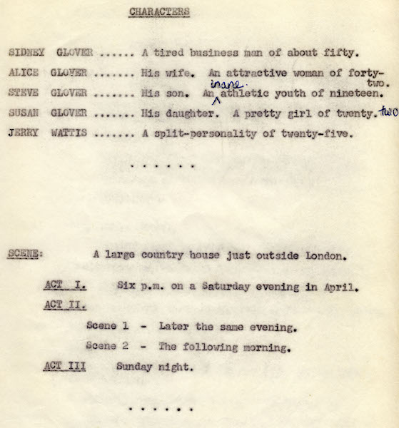

The Borthwick Institute for Archives holds an original manuscript for Alan Ayckbourn's first play, *The Square Cat*. This is the cast page for the play.

*Do not reproduce images without permission of the copyright holder.*

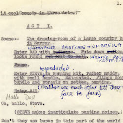

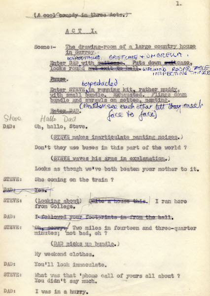

The Borthwick Institute for Archives holds an original manuscript for Alan Ayckbourn's first play, *The Square Cat*. This is the first page of the play complete with Alan's own notes.

*Do not reproduce images without permission of the copyright holder.*

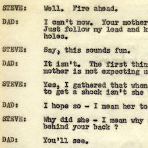

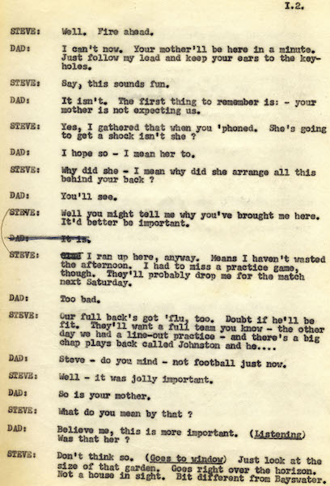

The Borthwick Institute for Archives holds an original manuscript for Alan Ayckbourn's first play, *The Square Cat*. This is the second page of the manuscript.

*Do not reproduce images without permission of the copyright holder.*    *The Scene, Archive Images and Research pages are presented in association with the* ***[Borthwick Institute for Archives](/)*** *at the University of York, where the Ayckbourn Archive is held.*

*All images on this page are copyright of the respective and labelled individual / organisation and should not be reproduced without permission.*  
