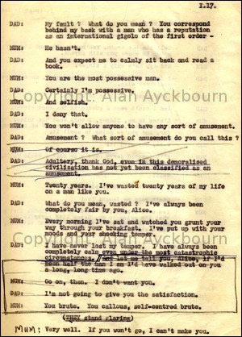

*This page reproduces a scene from the play offering an insight into and a taste of the work. The dialogue is reproduced in the style of the original including grammatical choices / errors.*  
*Dialogue in italics indicates material cut from the performed script.*

**Act I** (pages 16 - 18)  
**Mum:** (Summoning strength - determined.) Sidney, you can't stay here.  
**Dad:** (Startled) What?  
**Mum:** I've thought about it very carefully and I must ask you to leave.  
**Dad:** Now wait a minute -  
**Mum:** If you can't trust your own wife than that's your fault.  
**Dad:** My fault? What do you mean? You correspond behind my back with a man who has a reputation as an international gigolo of the first order -  
**Mum:** He hasn't.  
**Dad:** And you expect me to calmly sit back and read a book.  
**Mum:** You are the most possessive man.  
**Dad:** Certainly I'm possessive.  
**Mum:** And selfish.  
**Dad:** I deny that.  
**Mum:** You won't let anyone to have any sort of amusement.  
**Dad:** Amusement? What sort of amusement do you call this?  
***Mum:*** *Of course it is.*  
***Dad:*** *Adultery, thank God, even in this demoralised civilisation has not yet been classified as an amusement.*  
**Mum:** Twenty years. I've wasted twenty years of my life on a man like you.  
**Dad:** What do you mean, wasted? I've always been completely fair by you, Alice.  
**Mum:** Every morning I've sat and watched you grunt your way through your breakfast. I've put up with your moods and your shocking temper.  
**Dad:** I have never lost my temper. I have always been completely calm even under the most catastrophic circumstances. *And let me tell you, Alice, if I'd been half the man I am I'd have walked out on you a long, long time ago.*  
***Mum:*** *Go on, then. I don't want you.*  
***Dad:*** *I'm not going to give you the satisfaction.*  
***Mum:*** *You brute. You callous, self-centred brute.*  
…..….(They stand glaring)  
**Mum:** Very well. If you won't go, I won't make you.  
**Dad:** I can assure you, Alice, if I leave you leave with me.  
**Mum:** I invited Jerry down here and I intend to stay.
