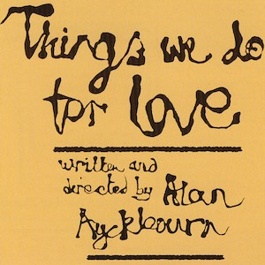
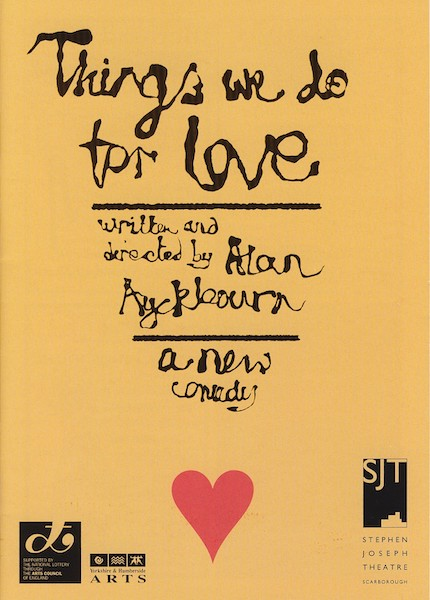
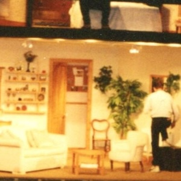
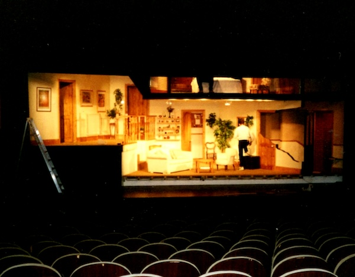
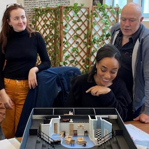
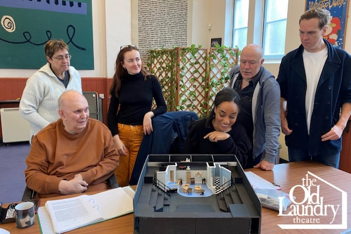
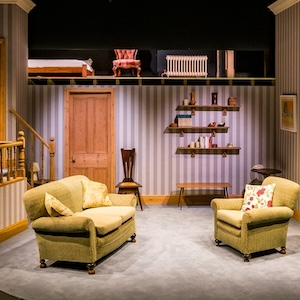
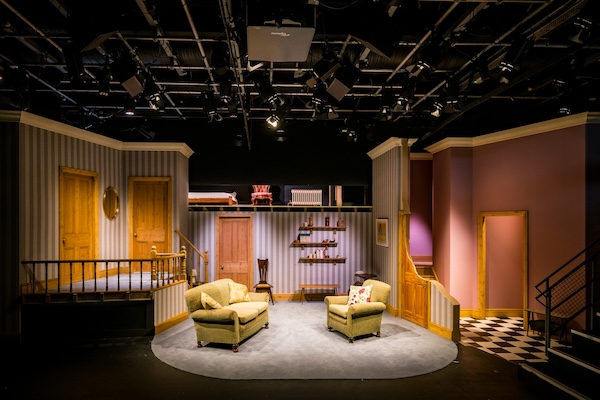

A collection of archive material, posters, rehearsal and production images pertaining to Alan Ayckbourn's *Things We Do For Love*. The Archive Images page is presented in association with the **[Borthwick Institute for Archives](/)** at the University of York where the Ayckbourn Archive is held. Click on an image to expand.

### Things We Do For Love (1997)

The poster for the world premiere of *Things We Do For Love* at the Stephen Joseph Theatre, Scarborough, in 1997.

**Copyright:** Scarborough Theatre Trust  
**Holding:** Borthwick Institute for Archives

*Do not reproduce images without permission of the copyright holder.*

The set for the London premiere of *Things We Do For Love*, designed by Roger Glossop, being constructed at the Gielgud Theatre in 1998.

*Do not reproduce images without permission of the copyright holder.*

Alan Ayckbourn with the company of the 2024 revival of *Things We Do For Love* looking at the model box of the set, designed by Roger Glossop.

**Copyright:** The Old Laundry Theatre  
**Holding:** Ayckbourn Digital Archive

*Do not reproduce images without permission of the copyright holder.*

The set of *Things We Do For Love* for the 2024 revival, directed by Alan Ayckbourn at the Old Laundry Theatre, Bowness-on-Windermere. The Old Laundry is a theatre-in-the-round and the space had to be halved to create an end-stage space.

**Photographer:** Steven Barber (© Steven Barber)  
**Holding:** Ayckbourn Digital Archive

*Do not reproduce images without permission of the copyright holder.*    *The Archive Images pages are presented in association with the* ***[Borthwick Institute for Archives](/)*** *at the University of York, where the Ayckbourn Archive is held.*

*All images on this page are copyright of the respective and labelled individual / organisation and should not be reproduced without permission.*  
