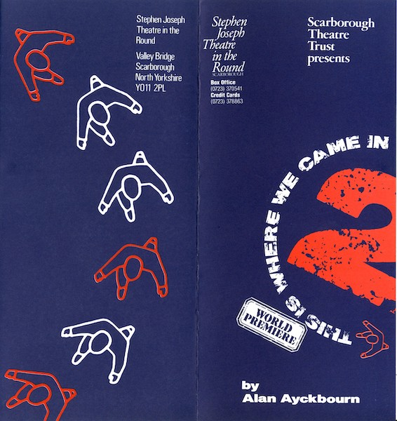
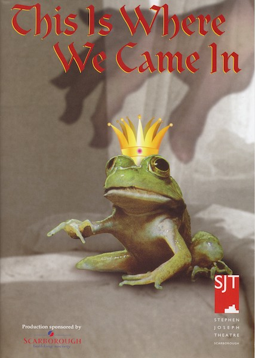

A collection of archive material, posters, rehearsal and production images pertaining to Alan Ayckbourn's *This Is Where We Came In*. The Archive Images page is presented in association with the **[Borthwick Institute for Archives](/)** at the University of York where the Ayckbourn Archive is held. Click on an image to expand.

### This Is Where We Came In (1990)

The programme cover for the world premiere of *This Is Where We Came In* at the Stephen Joseph Theatre in the Round, Scarborough, in 1990. This is for part two of the - then - two part play; a copy of the programme for the first part does not survive in archive

**Copyright:** Scarborough Theatre Trust  
**Holding:** Borthwick Institute for Archives

*Do not reproduce images without permission of the copyright holder.*

The poster for Alan Ayckbourn's 2001 revival of *This Is Where We Came In* at the Stephen Joseph Theatre, Scarborough, in 2001.

**Copyright:** Scarborough Theatre Trust  
**Holding:** Borthwick Institute for Archives

*Do not reproduce images without permission of the copyright holder.*      *The Archive Images pages are presented in association with the* ***[Borthwick Institute for Archives](/)*** *at the University of York, where the Ayckbourn Archive is held.*

*All images on this page are copyright of the respective and labelled individual / organisation and should not be reproduced without permission.*  
