A collection of archive material, posters, rehearsal and production images pertaining to Alan Ayckbourn's *Time & Time Again*. The Archive Images page is presented in association with the **[Borthwick Institute for Archives](/)** at the University of York where the Ayckbourn Archive is held. Click on an image to expand.

### Time & Time Again (1971)

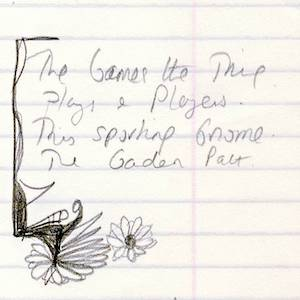

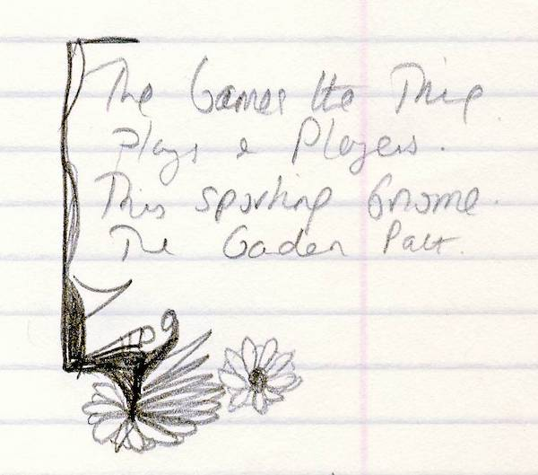

*Time & Time Again* is the earliest play of Alan Ayckbourn's for which his early notes survive in archive. This page includes his hand-written ideas for the title of the play: *The Game's The Thing*; *Plays & Players*; *The Sporting Gnome*; *The Garden Path*.

*Do not reproduce images without permission of the copyright holder.*

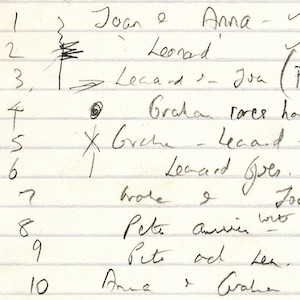

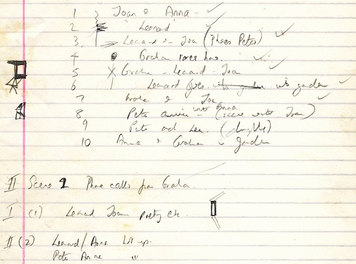

Early scene notes for *Time & Time Again* looking at characters and key plot points. *Time & Time Again* is the earliest play in archive for which Alan Ayckbourn's notes exist.

*Do not reproduce images without permission of the copyright holder.*

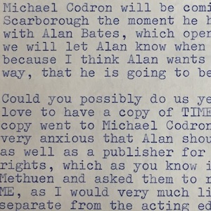

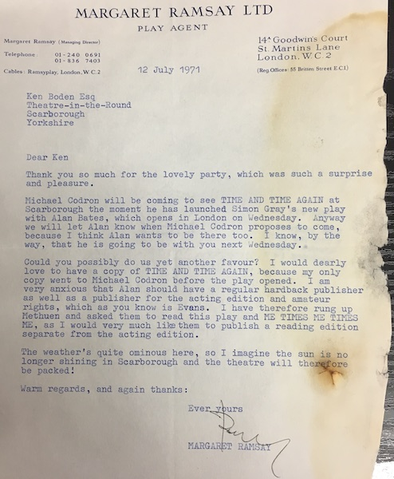

A letter from Alan Ayckbourn's agent, Margaret Ramsay, noting the West End producer, Michael Codron, wants to see *Time & Time Again* in Scarborough. He would go on to produce the play in London beginning a 30 year run of producing Ayckbourn West End premieres.

*Do not reproduce images without permission of the copyright holder.*

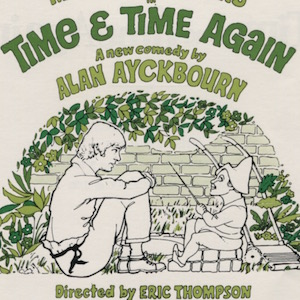

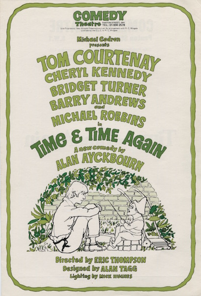

A flyer for the West End premiere of *Time & Time Again* in the West End in 1971.

**Copyright:** TBC  
**Holding:** Borthwick Institute For Archives

*Do not reproduce images without permission of the copyright holder.*

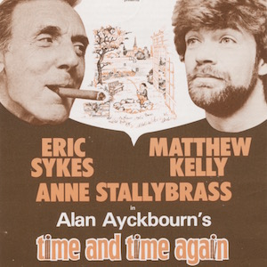

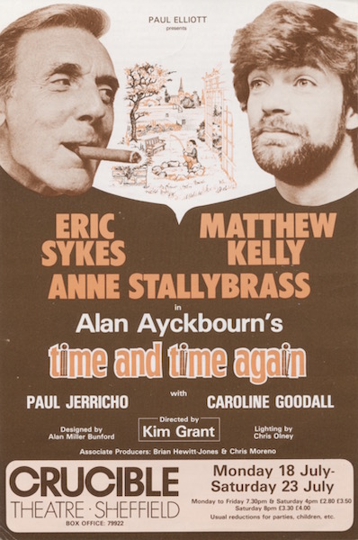

A flyer for a UK tour of *Time & Time Again* in 1983 starring Eric Sykes and Matthew Kelly; the play was extremely popular with repertory theatres during the 1970s and 1980s.

**Copyright:** TBC  
**Holding:** Borthwick Institute For Archives

*Do not reproduce images without permission of the copyright holder.983*

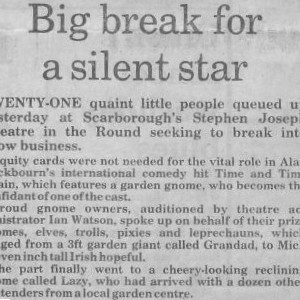

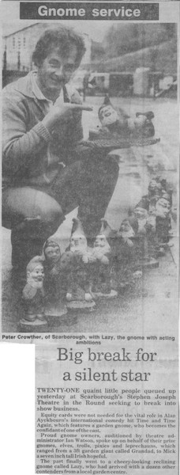

When *Time & Time Again* was revived by Alan Ayckbourn at the Stephen Joseph Theatre in the Round in 1986, the press officer - Russ Allen - organised a publicity stunt (one of several largely ill-conceived ideas) to audition gnomes for the play. Apparently 21 were entered although judging by production photographs, the winner did not actually appear in the production.

**Copyright:** The Scarborough News  
**Holding:** The Bob Watson Archive

*Do not reproduce images without permission of the copyright holder.*      *The Scene and Archive Images pages are presented in association with the* ***[Borthwick Institute for Archives](/)*** *at the University of York, where the Ayckbourn Archive is held.*

*All images on this page are copyright of the respective and labelled individual / organisation and should not be reproduced without permission.*  
