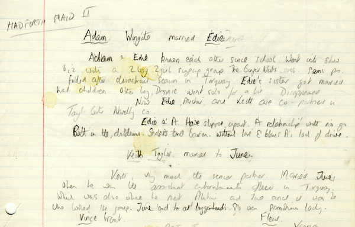
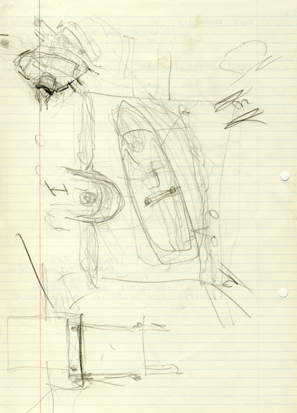
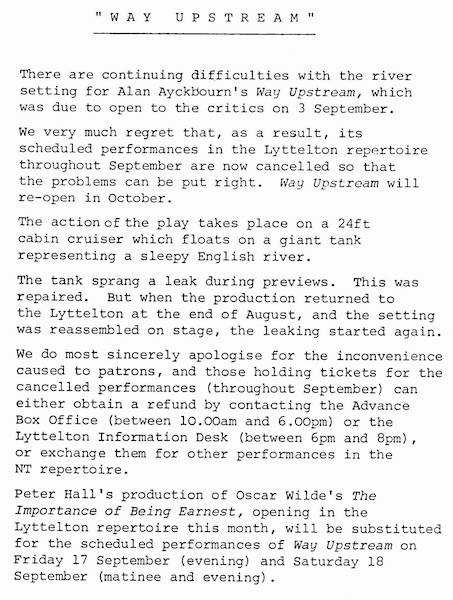
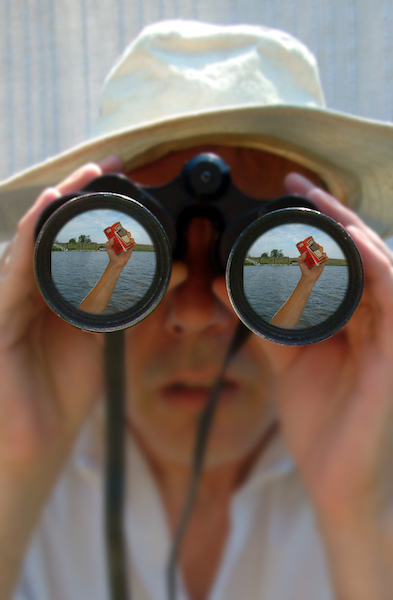

A collection of archive material, posters, rehearsal and production images pertaining to Alan Ayckbourn's *Way Upstream*. The Archive Images page is presented in association with the **[Borthwick Institute for Archives](/)** at the University of York where the Ayckbourn Archive is held. Click on an image to expand.

### Way Upstream (1981)

The earliest written notes for *Way Upstream* by Alan Ayckbourn reveal that Alistair and Emma were originally Adam and Edie (although, look closely and you can see her original name was probably June), Also the Hadforth Bounty was initially the Hadforth Maid II before being changed.

**Copyright:** Haydonning Ltd  
**Holding:** Borthwick Institute for Archives

*Do not reproduce images without permission of the copyright holder.*

An very early sketch of the set of *Way Upstream* by Alan Ayckbourn for the Stephen Joseph Theatre in the Round. The boat is not to scale as at this size, its movements would have been very limited compared to the actual boat.

**Copyright:** Haydonning Ltd  
**Holding:** Borthwick Institute for Archives

*Do not reproduce images without permission of the copyright holder.*

A press release noting the many issues which affected *Way Upstream* at the National Theatre in 1982 and which delayed the opening night by two months.

**Copyright:** National Theatre  
**Holding:** Borthwick Institute For Archives

*Do not reproduce images without permission of the copyright holder.*

An unused concept for a poster for Alan Ayckbourn's revival of *Way Upstream* at the Stephen Joseph Theatre, Scarborough, during 2003.

**Copyright:** Scarborough Theatre Trust  
**Holding:** Ayckbourn Digital Archive

*Do not reproduce images without permission of the copyright holder.*  
*The Scene and Archive Images pages are presented in association with the* ***[Borthwick Institute for Archives](/)*** *at the University of York, where the Ayckbourn Archive is held.*

*All images on this page are copyright of the respective and labelled individual / organisation and should not be reproduced without permission.*  
