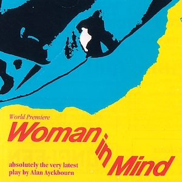
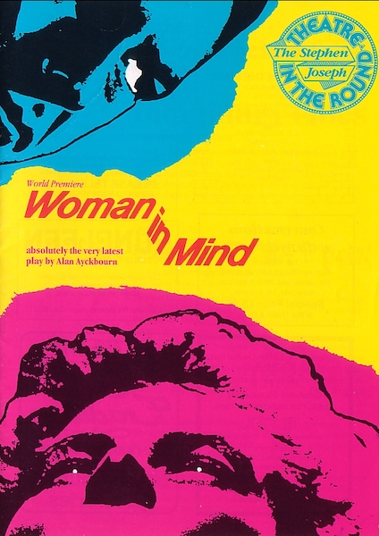
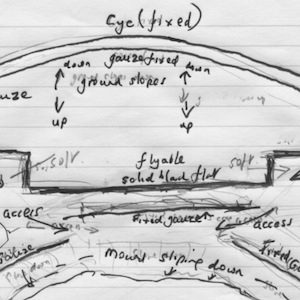
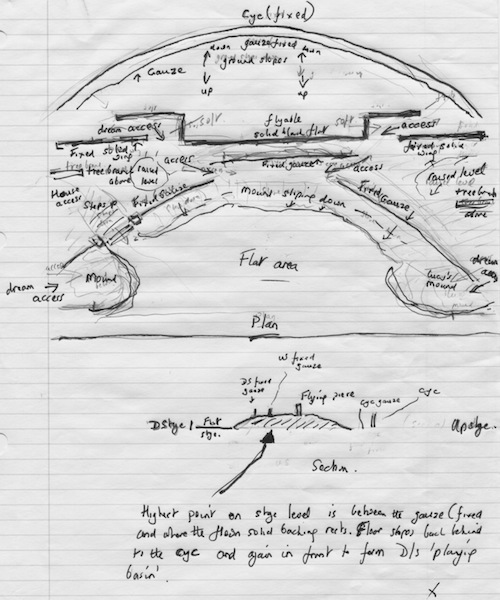
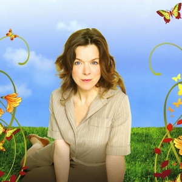
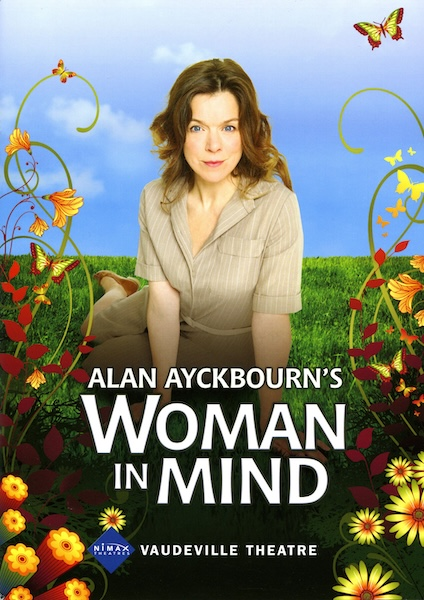
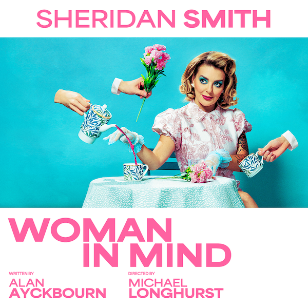

A collection of archive material, posters, rehearsal and production images pertaining to Alan Ayckbourn's *Woman in Mind*. The Archive Images page is presented in association with the **[Borthwick Institute for Archives](/)** at the University of York where the Ayckbourn Archive is held. Click on an image to expand.

### Woman in Mind (1985)

The poster for the world premiere of *Woman in Min*d at the Stephen Joseph Theatre in the Round, Scarborough, in 1985.

**Copyright:** Scarborough Theatre Trust  
**Holding:** Borthwick Institute for Archives

*Do not reproduce images without permission of the copyright holder.*

Alan Ayckbourn's sketch for the set design for the 2009 West End transfer of *Woman in Mind*. The production was originally staged in-the-round and was then adapted for the proscenium for the transfer.

*Do not reproduce images without permission of the copyright holder.*

The poster for the West End revival of Alan Ayckbourn's production of *Woman in Mind* at the Vaudeville Theatre in 2009.

**Copyright:** To be confirmed  
**Holding:** Ayckbourn Digital Archive

*Do not reproduce images without permission of the copyright holder.*

The poster for the 2025 West End revival of *Woman in Mind* at The Duke of York's Theatre, London, starring Sheridan Smith. This production marked the 40th anniversary of the play.

**Copyright:** Wessex Grove  
**Holding:** Ayckbourn Digital Archive

*Do not reproduce images without permission of the copyright holder.*    *The Archive Images pages are presented in association with the* ***[Borthwick Institute for Archives](/)*** *at the University of York, where the Ayckbourn Archive is held.*

*All images on this page are copyright of the respective and labelled individual / organisation and should not be reproduced without permission.*  
