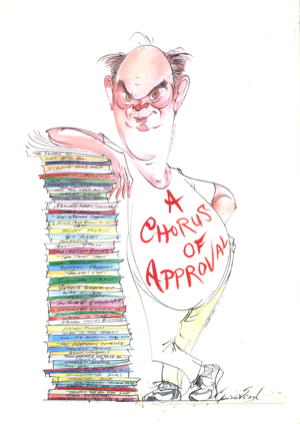

*A Chorus of Approval* was published in 1999 to celebrate Sir Alan Ayckbourn's 60th birthday marked by the *A Chorus of Approval* event at the Stephen Joseph Theatre, Scarborough, that year. The cover features art by the celebrated artist Gerald Scarfe.

Written and compiled by Jeannie Swales, this glossy A4 publication includes written tributes by the likes of Andrew Lloyd Webber, Sir Peter Hall, Harold Pinter, Tamzin Outhwaite, Bob Peck and a preface by his biographer, Michael Billington.

It includes a guide to his career with the company from 1957 to 1999 as well as an article on his brief career as a professional actor, production details for all his plays premiered at Scarborough between 1959 and 1999, various lists about his life and career as well as copious photographs from throughout his professional theatre career.

Published in 1999 and never reprinted, this is an original copy of the publication in near mint condition. Some of the copies have slight yellowing on the cover but are otherwise as new and unread. This is quite rare and, obviously, stocks are limited.

If you have any enquiries about *A Chorus of Approval* or are enquiring about international orders, please contact Simon Murgatroyd via **[admin@alanayckbourn.net](mailto:admin@alanayckbourn.net)**.

### Details

**Title:** A Chorus of Approval  
**Author:** Jeannie Swales  
**Published:** 1999  
**Price:** £10 (P&P included - UK only) **Pages:** 72 (B/W with spot colour)  
**Format:** Softcover, A4, glossy  
**Publisher:** Stephen Joseph Theatre  
**ISBN:** N/A   

**£10.00**  
UK only - includes  
postage & packing
