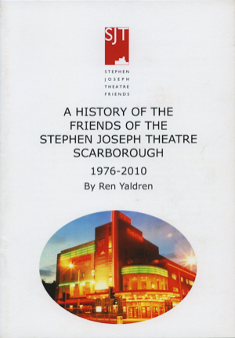

A 24 page booklet published by the Stephen Joseph Theatre to celebrate the history of the Friends of the Stephen Joseph Theatre - ironically just before the organisation was disbanded by the theatre, rebranded and relaunched.

*A History of the Friends of the Stephen Joseph Theatre Scarborough 1976 - 2010* is a history of the influential voluntary organisation and how it became a significant part of the theatre's social programme and fund-raising between the 1970s and 1990s.

Written by local author, Ren Yaldren, it is the only account of the organisation's history and contribution to theatre in the round in Scarborough.

Never reprinted, this is an original copy of the booklet which is now extremely rare. Only several copies are available all is as new condition.

If you have any enquiries about *Unseen Ayckbourn* or are enquiring about international orders, please contact Simon Murgatroyd via **[admin@alanayckbourn.net](mailto:admin@alanayckbourn.net)**.

### Details

**Title:** A History of the Friends of the SJT Scarborough  
**Author:** Ren Yaldren  
**Published:** 2010  
**Price:** £8 (P&P included - UK only)  
**Pages:** 24 (B/W)  
**Format:** Booklet, A5  
**Publisher:** Stephen Joseph Theatre  
**ISBN:** N/A  

**£8**  
UK only - includes  
postage & packing
