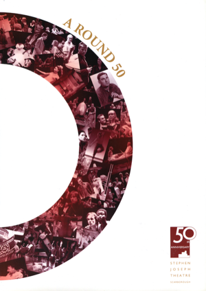

*A Round 50* was published in 2005 to celebrate the 50th anniversary of Alan Ayckbourn's home theatre, the Stephen Joseph Theatre, Scarborough.

Written by his archivist, Simon Murgatroyd M.A., and published by the theatre, this is a glossy A4 publication with copious photographs - in colour and mono - from the first five decades of the company.

It consists of a brief year-by-year account of the company and notable events and productions, a complete play-list for the company from 1955 - 2005 as well as an essay looking at the various venues considered for homes for the company over 50 years but which never came to be.

Published in 2005 and never reprinted, these are original first printings of the publication and, obviously, increasingly rare. Stock is limited.

If you have any enquiries about *A Round 50* or are enquiring about international orders, please contact Simon Murgatroyd via **[admin@alanayckbourn.net](mailto:admin@alanayckbourn.net)**.

### Details

**Title:** A Round 50  
**Author:** Simon Murgatroyd  
**Published:** 2005  
**Price:** £10 (P&P included - UK only) **Pages:** 64 (Colour)  
**Format:** Softcover, A4, glossy  
**Publisher:** Stephen Joseph Theatre  
**ISBN:** N/A   

**£10.00**  
UK only - includes  
postage & packing
