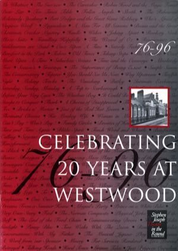

An original A4 souvenir programme published to celebrate the final production of the Stephen Jospeh Theatre in the Round in January 1996 - the second home of theatre-in-the-round in Scarborough.

The bulk of the content is dedicated to Alan Ayckbourn's personal recollection of the twenty years the company had been at 'Westwood' as well as production details for the final production at the theatre, a revival of Alan Ayckbourn's classic *Just Between Ourselves*.

It also includes photographs from productions at the theatre between 1976 - 1996, illustrating the history of the company.

This item from 1996 is obviously rare and remaining numbers are limited.

If you have any enquiries about *Celebrating 20 Years at Westwood* or are enquiring about international orders, please contact Simon Murgatroyd via **[admin@alanayckbourn.net](mailto:admin@alanayckbourn.net)**.

### Details

**Title:** Celebrating 20 Years at Westwood  
**Author:** Alan Ayckbourn  
**Published:** 1996  
**Price:** £10 (P&P included - UK only)  
**Pages:** 40 (B/W)  
**Format:** Softcover, A4  
**Publisher:** Stephen Joseph Theatre in the Round  
**ISBN:** N/A  

**£10.00**  
UK only - includes  
postage & packing
