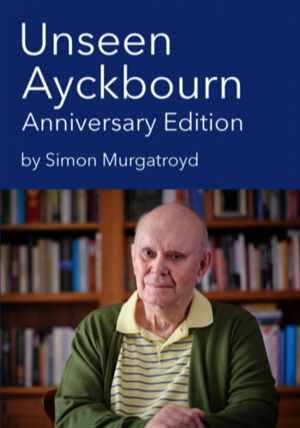

Published in 2019 to mark Alan Ayckbourn's 80th birthday and the 60th anniversary of his playwriting debut, *Unseen Ayckbourn: Anniversary Edition* was limited to 50 numbered copies, signed by the author.

This updated and revised edition of the book was only available during 2019 and has now been withdrawn. The current edition of the book is *Unseen Ayckbourn* which is available **[here](/publications/book-store/unseen-ayckbourn)**.

The edition number and owners can be found below.

### Unseen Ayckbourn: Anniversary Edition (Limited Edition: 50 Copies)

**1:**….Mo Murgatroyd  
**2:**….Atticus Arthur Aldred  
**3:**….Jennifer & Ian Waterhouse  
**4:**….Robert Shearman  
**5:**….Maria & Rob Sykes  
**6:**….Francois Thomas  
**7:**….John Cotgrave  
**8:**….Dick & Lottie  
**9:**….Philip Cartledge  
**10:**…Bill Pringle  
**11:**…Anonymous  
**12:**…John & Linda Sutton  
**13:**…Avril Powell  
**14:**…Peter Scott  
**15:**…Peter Lucey  
**16:**…Victor Craven  
**17:**…James Clare  
**18:**….Sue Volans  
**19:**….Catriona Jackson-Graham  
**20:**….Mike Linham  
**21:**….Jim Douglas  
**22:**….Sue Standard-Sheader  
**23:**….James & Diana Drife  
**24:**….Clare & Gerard Fulton  
**25:**….Valerie & Wynter Weston  
**26:**….Linda & Phil George  
**27:**….Ros & Alan Haigh  
**28:**….Jane Epstein  
**29:**….Gillian & Austen Sleightholme  
**30:**….Joan & Charlie Rankin  
**31:**….Tania Smith  
**32:**….Lynne & Dave Arnison  
**33:**….Ashley Burgoyne  
**34:**….David Tettersell  
**35:**….Siobhain Wood  
**36:**….Simon Hollis  
**37:**….Geofferson  
**38:**….Paul Fendley  
**39:**….Margaret Ray  
**40:**….Anonymous  
**41:**….Dave Shaw  
**42:**….Matt Hills  
**43:**….Tim Hampson  
**44:**….Sal Hampson  
**45:**….Simon Walton  
**46:**….Jane Dingle  
**47:**….Sue Whitehouse  
**48:**….Anonymous  
**49:**….Anonymous  
**50:**….Anonymous  
*With thanks to the photographer Tony Bartholomew (****[www.bartpics.co.uk)](http://www.bartpics.co.uk/)*** *for permission to use his official 80th anniversary portrait for the cover of Unseen Ayckbourn: Anniversary Edition.*
