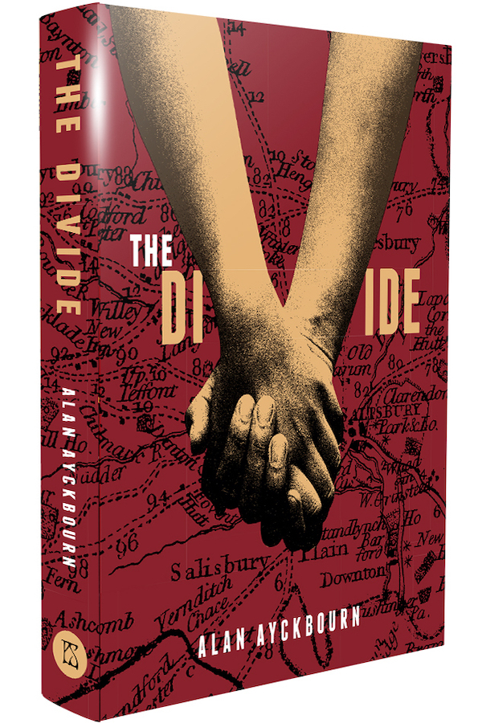

*The Divide* is Alan Ayckbourn's first novel and was published on 12 September 2019 by P.S. Publishing.

<aside>

### Formats

○ **Hardcover**  
*(ISBN: 9781786364470)*  
○ **Softcover**  
*(ISBN: 9781786364487)*

### Other Editions (Sold Out)

○ **Ltd Edition Signed Hardcover**  
*(ISBN: 9781786364463)*

</aside>

Renowned playwright Alan Ayckbourn's first novel *The Divide*, published by PS Publishing, is a fable that unflinchingly examines a dystopian society of brutal repression, forbidden love and seething insurrection.

The celebrated novelist Soween Clay-Flyn recalls a period in recent history based on documents of the time, including her own personal diary as a young girl who lived through it and survived to tell the tale.

In the aftermath of a deadly contagion which has decimated the population, contact between men and women has become fatal. Under the dictates of an unseen authoritarian leader known as The Preacher, an unthinkable solution has been enforced.

Soween and her older brother Elihu grow up learning the ways of their tightly controlled society. Then to Soween's alarm, Elihu, as he reaches pubescence, risks not only fatal disease but also threatens to ignite a bloody revolution.

Alan Ayckbourn says: “This is a new experience for me. Eighty-three plays, God knows how many nerve-racking theatre press nights and now this. The very first book launch of my very first novel. Lord, the things you take on at 80!”

Nicky Crowther, of PS Publishing, says: “Straddling literary genres for almost a quarter century during which time we have championed work by some of the finest talents in the business, PS Publishing is proud to announce *The Divide*, the debut novel from Alan Ayckbourn, one of the world’s most gifted playwrights.”

*The Divide* is published by PS Publishing and was made available in limited edition hardback with slipcase, hardback and softcover. The PS Publishing website can be found **[here](http://pspublishing.co.uk/index.asp)**.  
*All research for this page by Simon Murgatroyd.*
